# LeWorldModel (LeWM) — Tài liệu học

> **Paper:** *LeWorldModel: Stable End-to-End Joint-Embedding Predictive Architecture from Pixels* — Lucas Maes\*, Quentin Le Lidec\*, Damien Scieur, Yann LeCun, Randall Balestriero (Mila & Université de Montréal · New York University · Samsung SAIL · Brown University). Preprint arXiv:2603.19312v3 [cs.LG], 3 Jun 2026. Bản PDF nằm ở [`../docs/LeWorldModel.pdf`](../docs/LeWorldModel.pdf).
>
> **File này là gì:** bản diễn giải đầy đủ để **học**, viết thành câu hoàn chỉnh, mỗi khái niệm đều được giải thích chứ không chỉ liệt kê từ khoá. Mọi con số trong đây đã được đối chiếu với PDF gốc; chỗ nào paper nói mập mờ hoặc slide nói chưa đủ thì tôi ghi rõ ở [Phụ lục 2](#phụ-lục-2--đối-chiếu-slide--paper).
>
> **File liên quan:** [`slides_text.md`](slides_text.md) là bản trích nguyên văn chữ trên slide [`index.html`](index.html) — dùng khi cần biết chính xác slide đang viết gì, không dùng để học.

---

## Mục lục

- [Phần 0. Bài toán paper đang giải: input, output, cách xử lý](#phần-0-bài-toán-paper-đang-giải-input-output-cách-xử-lý)
- [Phần 1. Nền tảng: World Model, JEPA và bệnh collapse](#phần-1-nền-tảng-world-model-jepa-và-bệnh-collapse)
- [Phần 2. Phương pháp LeWM](#phần-2-phương-pháp-lewm)
- [Phần 3. Dùng world model để hành động: latent planning](#phần-3-dùng-world-model-để-hành-động-latent-planning)
- [Phần 4. Thí nghiệm và kết quả](#phần-4-thí-nghiệm-và-kết-quả)
- [Phần 5. Latent space có "hiểu" vật lý không?](#phần-5-latent-space-có-hiểu-vật-lý-không)
- [Phần 6. Tính ổn định và các ablation](#phần-6-tính-ổn-định-và-các-ablation)
- [Phần 7. Hạn chế, đóng góp và câu hỏi mở](#phần-7-hạn-chế-đóng-góp-và-câu-hỏi-mở)
- [Phần 8. Từ điển thuật ngữ](#phần-8-từ-điển-thuật-ngữ)
- [Phần 9. Tài liệu nên đọc thêm](#phần-9-tài-liệu-nên-đọc-thêm)
- [Phụ lục 1. Bảng tra số liệu gốc](#phụ-lục-1--bảng-tra-số-liệu-gốc)
- [Phụ lục 2. Đối chiếu slide ↔ paper](#phụ-lục-2--đối-chiếu-slide--paper)

---

# Phần 0. Bài toán paper đang giải: input, output, cách xử lý

Phần này là phần quan trọng nhất nếu bạn mới đọc paper lần đầu. Đọc xong phần này bạn phải trả lời được ba câu: *paper đưa cái gì vào*, *lấy cái gì ra*, và *biến đổi qua những bước nào*.

## 0.1. Bối cảnh: tại sao người ta cần world model

Mục tiêu xa của lĩnh vực này là xây dựng một agent (tác tử) có thể học nhiều kỹ năng khác nhau, trong nhiều môi trường khác nhau, bằng **một cách học duy nhất**, và quan trọng là học **trực tiếp từ camera** chứ không cần con người thiết kế sẵn "trạng thái" cho nó. Camera thì rẻ và có ở khắp nơi, nên nếu học được thẳng từ pixel thì hệ thống dễ mở rộng hơn nhiều so với việc phải gắn cảm biến đo vị trí, đo góc khớp cho từng bài toán.

**World Model (mô hình thế giới)** là một mô hình học cách **dự đoán hậu quả của hành động**. Nếu agent có một world model đủ tốt, nó có thể "tưởng tượng" trong đầu: *nếu tôi đẩy tay sang trái 5 cm thì cảnh vật sẽ thành ra thế nào?* Nhờ đó agent thử nghiệm hàng trăm phương án **trong tưởng tượng** rồi mới chọn phương án tốt nhất để thực thi ngoài đời thật.

Khả năng này đặc biệt quý trong **offline setting** — tình huống mà agent chỉ có một tập dữ liệu cố định đã thu sẵn, **không được phép tương tác thêm với môi trường** để thử nghiệm. Đây là tình huống thực tế của phần lớn bài toán robot: cho robot thật đâm vào tường vài nghìn lần để học là chuyện không ai làm được.

## 0.2. Phát biểu bài toán mà LeWM nhắm tới

Trong họ world model, có một nhánh gọi là **JEPA** (Joint-Embedding Predictive Architecture) do Yann LeCun đề xuất. Ý tưởng của JEPA: thay vì dự đoán **ảnh** của tương lai (rất đắt, và phần lớn chi tiết ảnh là vô ích cho việc điều khiển), ta nén ảnh thành một **vector nhỏ** rồi chỉ dự đoán **vector** của tương lai.

Vấn đề: JEPA rất hay về mặt ý tưởng nhưng **cực kỳ khó train ổn định**, vì nó dễ rơi vào **representation collapse** (giải thích kỹ ở mục [0.7](#07-vì-sao-bài-toán-này-khó-representation-collapse)). Từ trước tới nay, người ta chống collapse bằng những cách chắp vá: dùng EMA và stop-gradient, cộng thêm rất nhiều số hạng phụ vào hàm loss, hoặc đóng băng một encoder đã pretrain sẵn. Mỗi cách đều phải trả một cái giá.

**Bài toán của paper, phát biểu cho gọn:** *làm sao train được một JEPA world model, học từ đầu đến cuối (end-to-end) trực tiếp từ pixel thô, một cách ổn định, mà không cần bất kỳ heuristic chống collapse nào, và có bảo đảm lý thuyết rằng nó không collapse?*

Câu trả lời của paper là **LeWorldModel (LeWM)**: một objective chỉ có **hai số hạng** và **một hyperparameter**, trong đó số hạng thứ hai (SIGReg) ép phân phối của embedding phải là **Gaussian đẳng hướng** — mà phân phối Gaussian thì mọi chiều đều có phương sai dương, nên về mặt toán học *không thể* collapse về một điểm.

## 0.3. Input — mô hình nhận vào cái gì

Phải phân biệt hai giai đoạn, vì input của hai giai đoạn khác hẳn nhau.

### Input lúc train

Mô hình được train **hoàn toàn offline** và **hoàn toàn không có reward**. Dữ liệu chỉ gồm các quỹ đạo (trajectory) đã thu sẵn:

| Thành phần | Ký hiệu | Mô tả cụ thể |
|---|---|---|
| Chuỗi quan sát | `o_1:T` | Các frame ảnh **pixel thô**, RGB, kích thước 224×224. Không hề qua bước trích đặc trưng thủ công nào. |
| Chuỗi hành động | `a_1:T` | Hành động **liên tục** (continuous action) tương ứng với từng bước. Mọi môi trường trong paper đều có không gian hành động liên tục. |

Điểm cần nhớ về dữ liệu này:

- **Không có reward.** Đây là điều phân biệt LeWM với cả nhánh Dreamer/TD-MPC, vốn cần tín hiệu thưởng để học.
- **Không có nhãn nhiệm vụ.** Model không biết nó đang học để làm gì; nó chỉ học "quy luật vận động" của môi trường. Vì thế paper gọi đây là **task-agnostic**.
- **Không có proprioception** (thông tin nội tại của robot như góc khớp, vận tốc khớp). Model chỉ nhìn thấy ảnh.
- **Không cần quỹ đạo tối ưu.** Paper nói rõ: quỹ đạo có thể do một policy dở, một policy khám phá ngẫu nhiên, hay một policy "gần chuyên gia" sinh ra cũng được — **miễn là chúng phủ đủ dynamics của môi trường**. Đây là một yêu cầu quan trọng, và cũng chính là chỗ mà LeWM sẽ yếu đi khi dữ liệu quá nghèo nàn (xem [4.4](#44-kết-quả-planning-và-cách-đọc-chúng-cho-đúng)).

Về mặt tensor thực tế khi chạy code (App. D của paper):

```
obs     : (B, T, C, H, W) = (128, 4, 3, 224, 224)
actions : (B, T, A)
```

Trong đó `B = 128` là batch size, và `T = 4` là độ dài của một **sub-trajectory** — tức mỗi mẫu train chỉ là một đoạn 4 frame cắt ra từ quỹ đạo dài, chứ không phải cả quỹ đạo 200 bước.

Có một chi tiết dễ bỏ qua nhưng ảnh hưởng lớn: **frame-skip bằng 5**. Paper gom 5 hành động liên tiếp giữa hai frame được giữ lại thành **một "action block"**. Nghĩa là mỗi bước mà model nhìn thấy tương đương 5 bước thật của môi trường. Lý do làm vậy: nó cho phép model dự đoán **xa hơn về thời gian với cùng chi phí tính toán**, đồng thời hai frame liên tiếp vẫn khác nhau đủ nhiều để việc dự đoán còn mang thông tin (nếu hai frame gần như giống hệt nhau thì bài toán dự đoán trở nên tầm thường). Vậy nên `T = 4` frame tương ứng với **4 block × 5 hành động**.

### Input lúc dùng (planning)

Sau khi train xong, muốn sai khiến agent làm việc gì đó, ta đưa vào:

| Thành phần | Ký hiệu | Mô tả |
|---|---|---|
| Quan sát hiện tại | `o_1` | Một ảnh, tình trạng hiện tại của môi trường. |
| Quan sát đích | `o_g` | **Một ảnh** mô tả trạng thái mong muốn. Đây chính là cách người dùng "ra lệnh": không viết lệnh, không đặt reward, mà **đưa một tấm ảnh của cái đích**. |

Cách ra lệnh bằng ảnh này gọi là **goal-conditioned** — điều kiện hoá theo mục tiêu.

## 0.4. Output — mô hình trả về cái gì

### Output của quá trình train

Kết quả train là **hai mạng neural** đã được học **đồng thời**:

```
Encoder   : z_t     = enc_θ(o_t)            ảnh 224×224 → vector 192 chiều
Predictor : ẑ_{t+1} = pred_φ(z_t, a_t)      (vector hiện tại, hành động) → vector kế tiếp
```

Encoder có khoảng **5M tham số**, predictor khoảng **10M**, tổng cộng **~15M** — nhỏ đến mức train được trong vài giờ **trên một GPU duy nhất**. Con số này đáng để so sánh: DINO-WM dùng DINOv2, một mô hình được pretrain trên khoảng **124 triệu ảnh**.

Ngoài ra paper còn train một **decoder** (latent → ảnh), nhưng phải nói rõ: decoder này được train **sau khi world model đã train xong**, **không** tham gia vào quá trình train world model, và chỉ dùng để **con người nhìn xem model đang tưởng tượng ra cái gì**. Nó là công cụ chẩn đoán, không phải một phần của phương pháp.

### Output của quá trình planning

Một **chuỗi hành động** `a*_1:H` với `H = 5` được cho là đưa môi trường từ `o_1` tới gần `o_g` nhất. Vì frame-skip là 5 nên `H = 5` block tương ứng **25 bước thật** của môi trường.

Điều đáng chú ý: **không có policy network nào được train cả**. Hành động được tìm ra bằng cách **tối ưu trực tiếp tại thời điểm chạy** — mỗi lần cần hành động là một lần giải bài toán tối ưu. Đây là khác biệt căn bản với nhánh Dreamer (train hẳn một policy rồi vứt world model đi lúc chạy).

## 0.5. Cách xử lý — quy trình train, từng bước một

Với mỗi batch dữ liệu, mô hình làm đúng năm việc sau:

**Bước 1 — Encode.** Mọi frame trong batch được đưa qua encoder để thành vector: `z_t = enc_θ(o_t)`. Đầu ra là tensor `(B, T, D)` với `D = 192`.

**Bước 2 — Dự đoán.** Predictor nhận `z_t` cùng hành động `a_t` và dự đoán vector của frame kế tiếp: `ẑ_{t+1} = pred_φ(z_t, a_t)`. Predictor làm việc **tự hồi quy (autoregressive)** trên một lịch sử `N` frame với **causal mask**, tức là khi dự đoán bước `t+1` nó chỉ được nhìn các bước `≤ t`, không được nhìn trộm tương lai.

**Bước 3 — Tính loss dự đoán.** So sánh vector dự đoán với vector thật bằng sai số bình phương:

```
𝓛_pred = ‖ẑ_{t+1} − z_{t+1}‖²₂
```

Ở đây `z_{t+1}` là embedding **thật** do chính encoder tạo ra từ frame thật — cách train này gọi là **teacher forcing** (luôn cho model xem đáp án đúng ở bước trước, thay vì bắt nó dùng chính dự đoán của nó).

**Bước 4 — Tính loss chống collapse (SIGReg).** Lấy toàn bộ embedding trong batch, kiểm tra xem phân phối của chúng có giống Gaussian đẳng hướng `𝒩(0, I)` không, và phạt theo mức độ lệch. Cơ chế cụ thể được giải thích chi tiết ở [mục 2.4](#24-loss-thứ-hai-sigreg--phần-quan-trọng-nhất-của-paper).

**Bước 5 — Cộng lại và lan truyền ngược.** Loss cuối cùng là

```
𝓛_LeWM = 𝓛_pred + λ · SIGReg(Z),   với λ = 0.1
```

Gradient chảy ngược qua **toàn bộ** mô hình, cập nhật encoder và predictor **cùng lúc**. Không có stop-gradient, không có EMA target encoder, không có encoder đóng băng. Đây chính là nghĩa của chữ **end-to-end** trong tên paper.

## 0.6. Cách xử lý — quy trình planning, từng bước một

**Bước 1.** Encode ảnh hiện tại và ảnh đích thành hai vector: `ẑ_1 = enc_θ(o_1)` và `z_g = enc_θ(o_g)`.

**Bước 2.** Khởi tạo ngẫu nhiên một chuỗi hành động ứng viên độ dài `H`.

**Bước 3.** Cho predictor "chạy trong tưởng tượng": từ `ẑ_1` và chuỗi hành động, lần lượt tính `ẑ_2, ẑ_3, …, ẑ_H`. Toàn bộ bước này diễn ra trong không gian latent, **không hề dựng lại ảnh nào**, nên rất nhanh.

**Bước 4.** Chấm điểm chuỗi hành động bằng khoảng cách từ trạng thái cuối tới đích:

```
C(ẑ_H) = ‖ẑ_H − z_g‖²₂
```

Chú ý: chỉ so **trạng thái cuối cùng** với đích, không cần reward ở từng bước. Đây là lý do phương pháp được gọi là **reward-free**.

**Bước 5.** Dùng một solver để sửa chuỗi hành động cho cost nhỏ đi, rồi quay lại bước 3. Trọng số của world model **bị đóng băng** trong suốt quá trình này — thứ duy nhất được tối ưu là chuỗi hành động.

**Bước 6.** Thực thi kế hoạch ra môi trường thật, quan sát ảnh mới, rồi **lập kế hoạch lại từ đầu** (đây là ý của MPC — xem [3.3](#33-mpc--vì-sao-phải-lập-kế-hoạch-lại-liên-tục)).

## 0.7. Vì sao bài toán này khó: representation collapse

Đây là chỗ cần hiểu thật kỹ, vì toàn bộ paper xoay quanh nó.

Giả sử ta chỉ train với một mình `𝓛_pred`. Hàm loss này có một **nghiệm gian lận hoàn hảo**: nếu encoder học cách trả về **cùng một vector hằng số `c`** cho *mọi* bức ảnh, thì:

```
enc(o) = c  với mọi o   ⟹   z_t = z_{t+1} = c
                         ⟹   predictor chỉ cần luôn trả về c
                         ⟹   ‖ẑ_{t+1} − z_{t+1}‖² = 0
```

Loss bằng **0** — thấp nhất có thể — nhưng representation **hoàn toàn vô dụng**: mọi ảnh đều được mã hoá thành cùng một điểm, model không phân biệt nổi tình huống này với tình huống khác. Quá trình tối ưu bằng gradient descent rất thích nghiệm này vì nó dễ đạt tới hơn nhiều so với việc thật sự học dynamics.

Hiện tượng đó gọi là **representation collapse** (sụp đổ biểu diễn), và ngăn nó xảy ra là **bài toán trung tâm** của cả dòng nghiên cứu JEPA. Mọi phương pháp JEPA đều phải trả lời câu hỏi: *làm sao ép encoder trải các ảnh ra thay vì dồn hết về một điểm?*

## 0.8. Tóm tắt Phần 0 trong một bảng

| Câu hỏi | Trả lời |
|---|---|
| Bài toán | Train JEPA world model end-to-end từ pixel, ổn định, không heuristic, có bảo đảm không collapse |
| Input (train) | Quỹ đạo offline `(o_1:T, a_1:T)`: ảnh RGB 224×224 + hành động liên tục. Không reward, không nhãn task, không proprioception |
| Output (train) | Encoder (~5M params) + Predictor (~10M params), tổng ~15M |
| Input (dùng) | Ảnh hiện tại `o_1` + **ảnh đích** `o_g` |
| Output (dùng) | Chuỗi hành động `a*_1:H` (H = 5 block ≈ 25 bước môi trường) |
| Hàm mục tiêu | `𝓛 = 𝓛_pred + λ·SIGReg(Z)` — 2 số hạng, 1 hyperparameter (`λ = 0.1`) |
| Ý tưởng cốt lõi | Chống collapse bằng cách ép phân phối embedding thành Gaussian đẳng hướng, thay vì bằng heuristic |
| Kết quả nổi bật | Push-T 96% (hơn PLDM 18 điểm); lập kế hoạch trong **0.98 giây** thay vì 47 giây của DINO-WM |

---

# Phần 1. Nền tảng: World Model, JEPA và bệnh collapse

## 1.1. Hai trường phái làm world model

Có hai cách tiếp cận lớn, khác nhau ở chỗ **dự đoán cái gì**.

**Trường phái generative — dự đoán pixel.** Các phương pháp như IRIS, DIAMOND, Δ-IRIS, DreamerV4, OASIS, Genie, HunyuanWorld đều sinh ra **frame ảnh của tương lai**, có điều kiện theo trạng thái và hành động quá khứ. Chúng hoạt động như những **trình mô phỏng học được**: đã có nhóm dùng chúng để mô phỏng Minecraft, Counter-Strike, Crafter, thậm chí để đánh giá policy robot mà không cần chạy robot thật.

Điểm yếu của trường phái này: để dự đoán được một bức ảnh, model buộc phải mô hình hoá **mọi chi tiết** trong ảnh — từng gợn mây, từng vân gỗ, từng hạt nhiễu của cảm biến. Phần lớn những chi tiết đó **không liên quan gì** đến việc điều khiển, nhưng model vẫn phải tốn dung lượng và tính toán cho chúng. Ngoài ra, nhiều phương pháp trong nhánh này cần dataset **có kèm reward**, tức là đã ràng buộc vào một nhiệm vụ cụ thể.

**Trường phái JEPA — dự đoán trong không gian latent.** JEPA nén ảnh thành một vector nhỏ `z` rồi chỉ dự đoán `z` của tương lai. Vì loss được tính trong không gian latent chứ không phải không gian pixel, model **không bị bắt buộc** phải giữ lại những chi tiết vô nghĩa: nếu một chi tiết không giúp gì cho việc dự đoán, encoder cứ việc vứt nó đi. Nói cách khác, sức ép "phải dự đoán được" tự nó là một bộ lọc chọn lọc thông tin.

JEPA vì thế là **reward-free** (không cần thưởng), **reconstruction-free** (không cần dựng lại ảnh), và **task-agnostic** (không gắn với nhiệm vụ nào).

Từ khi LeCun đề xuất, nhánh JEPA đã phát triển theo hai hướng: một hướng dùng cho **học biểu diễn tự giám sát** (I-JEPA cho ảnh, V-JEPA và V-JEPA 2 cho video, Brain-JEPA và Echo-JEPA cho dữ liệu y tế), và một hướng dùng cho **world model có điều kiện hành động** — chính là nhánh mà LeWM thuộc về.

## 1.2. Ba nhóm giải pháp chống collapse trước LeWM, và cái giá của từng nhóm

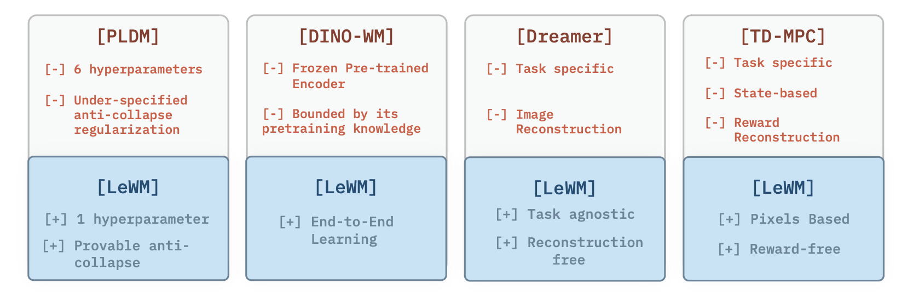

*Figure 2 — Phân nhóm các hướng làm latent world model theo cách train. LeWM lấy điểm mạnh của cả ba nhóm.*

**Nhóm 1 — EMA cộng stop-gradient** (I-JEPA, V-JEPA). Ý tưởng: tạo hai bản encoder, một bản "học sinh" được cập nhật bằng gradient và một bản "giáo viên" được cập nhật bằng trung bình trượt luỹ thừa (EMA) của học sinh; đồng thời chặn gradient không cho chảy qua nhánh giáo viên. Cách này **thực tế chạy được**, nhưng cái giá là: nó **không tương ứng với việc tối thiểu hoá một hàm mục tiêu xác định nào cả**. Bạn không viết ra được công thức mà thuật toán đang tối ưu, nên rất khó phân tích, khó dự đoán khi nào nó hỏng, và khó cải tiến có định hướng.

**Nhóm 2 — Đóng băng encoder đã pretrain** (DINO-WM). Nếu encoder không được học thì nó không thể collapse — hết bệnh. DINO-WM dùng DINOv2 làm encoder cố định và chỉ train predictor. Cái giá: **mất tính end-to-end**. Representation bị chặn cứng bởi những gì DINOv2 đã học từ trước; nếu môi trường của bạn có đặc thù mà DINOv2 chưa từng thấy, encoder không thể thích nghi. Ngoài ra encoder loại này rất nặng, sinh ra rất nhiều token cho mỗi ảnh — điều này sẽ trở thành nút thắt tốc độ lúc lập kế hoạch.

**Nhóm 3 — VICReg cộng nhiều số hạng phụ** (PLDM). Đây là baseline gần LeWM nhất vì nó **cũng học end-to-end từ pixel**. PLDM chống collapse bằng cách mượn ý tưởng từ VICReg (điều chỉnh phương sai và hiệp phương sai của embedding) rồi cộng thêm các số hạng để xử lý chiều thời gian. Hàm mục tiêu đầy đủ của PLDM là:

```
𝓛_PLDM = 𝓛_pred + α·𝓛_var + β·𝓛_cov + γ·𝓛_time-sim
                + ζ·𝓛_time-var + ν·𝓛_time-cov + μ·𝓛_IDM
```

Tức **7 số hạng và 6 hệ số** phải tự tay chỉnh. Cái giá: train bất ổn, và việc dò hệ số trở thành ác mộng — không gian tìm kiếm là `O(n⁶)`. Tệ hơn nữa, bộ hệ số tốt cho môi trường này thường không tốt cho môi trường khác, nên **khó chuyển giao**.

**Nhóm 4 — Thêm tín hiệu phụ trợ** (ví dụ OSVI-WM): đưa thêm proprioception hoặc một action decoder vào để ổn định hoá. Cái giá là thêm giả định về dữ liệu — bạn phải có sẵn những tín hiệu đó.

**Vị trí của LeWM:** nó là **end-to-end từ pixel** như PLDM, nhưng chỉ có **1 hyperparameter** và có **bảo đảm lý thuyết** về chống collapse; nó **task-agnostic và reward-free** như DINO-WM nhưng **không cần encoder pretrain**; và nó **không cần reconstruct ảnh hay reward** như Dreamer/TD-MPC.

---

# Phần 2. Phương pháp LeWM

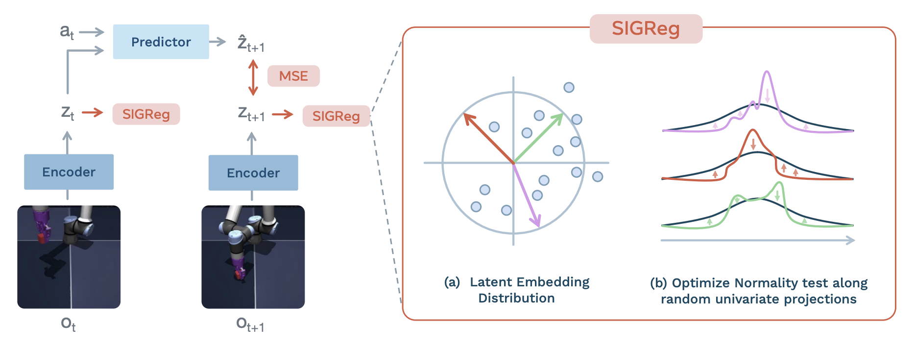

*Figure 1 — Pipeline train. Frame `o_t` đi qua encoder thành `z_t`; predictor nhận `z_t` cùng hành động `a_t` và dự đoán `ẑ_{t+1}`; sai số MSE được tính với `z_{t+1}` thật. SIGReg được áp lên embedding: chiếu chúng lên nhiều hướng ngẫu nhiên rồi kiểm tra tính chuẩn trên từng chiếu một chiều.*

## 2.1. Encoder — nén ảnh thành 192 con số

Encoder là một **Vision Transformer bản Tiny (ViT-Tiny)** lấy từ thư viện Hugging Face, với patch size 14, 12 lớp, 3 attention head, hidden dimension 192, tổng khoảng 5 triệu tham số. Ảnh đầu vào 224×224.

Embedding `z_t` được lấy từ **token [CLS]** ở lớp cuối cùng — tức là một vector 192 chiều tóm tắt cả bức ảnh — rồi đi qua thêm một **bước chiếu (projection)**: một MLP 1 lớp kèm **Batch Normalization**.

Bước chiếu này nghe có vẻ là chi tiết vặt, nhưng paper nói rõ nó **bắt buộc phải có**, và lý do rất đáng học: **lớp cuối của ViT có Layer Normalization**. LayerNorm chuẩn hoá lại từng vector về cùng một chuẩn và cùng một trung bình, nghĩa là nó **cưỡng bức áp một cấu trúc lên phân phối embedding**. Mà SIGReg thì lại đang cố ép phân phối đó thành Gaussian đẳng hướng. Hai thứ đá nhau: LayerNorm khiến objective chống collapse **không thể tối ưu được nữa**. Thêm một projection có BatchNorm ở sau là cách gỡ ra: nó đưa embedding sang một không gian mới mà SIGReg có thể tác động tự do.

Nếu bạn định tự implement lại, đây là một trong ba chi tiết dễ làm sai nhất.

## 2.2. Predictor — học quy luật vận động

Predictor là một transformer kiến trúc **ViT-S**: 6 lớp, 16 attention head, dropout 10%, khoảng 10 triệu tham số, có positional embedding học được và **causal mask** trên lịch sử quan sát.

Về cách nó nhận hành động: hành động **không** được nối (concatenate) vào input như cách làm thông thường, mà được đưa vào qua **AdaLN (Adaptive Layer Normalization)** ở **mỗi lớp**. AdaLN nghĩa là hành động được dùng để sinh ra các hệ số scale và shift cho LayerNorm của lớp đó — một kỹ thuật mượn từ DiT (Diffusion Transformer).

Quan trọng: các tham số AdaLN được **khởi tạo bằng 0**. Hệ quả là ở đầu quá trình train, hành động **gần như không ảnh hưởng gì** tới predictor; ảnh hưởng đó **lớn dần lên** khi model học. Paper nói điều này giúp **ổn định hoá quá trình train** — model được học phần dễ trước (cấu trúc của scene) rồi mới học phần khó sau (tác động của hành động).

Độ dài lịch sử `N` mà predictor nhìn lại: **3 frame** cho Push-T và OGBench-Cube, **1 frame** cho TwoRoom (môi trường này đơn giản, không cần nhiều ngữ cảnh).

Một chi tiết mà slide bỏ qua: **predictor cũng có một projector ở sau**, cài đặt y hệt projector của encoder.

## 2.3. Loss thứ nhất — prediction loss

```
𝓛_pred ≜ ‖ẑ_{t+1} − z_{t+1}‖²₂,     ẑ_{t+1} = pred_φ(z_t, a_t)        (Eq. 1)
```

Hàm này làm hai việc cùng lúc, và việc thứ hai mới là việc thú vị:

1. Nó **ép predictor học dynamics** — tức học xem hành động làm thay đổi trạng thái ra sao.
2. Nó **ép encoder tạo ra một biểu diễn dễ dự đoán**. Encoder không bị ai bảo phải giữ gì và bỏ gì; nhưng vì nó bị chấm điểm theo việc predictor có đoán trúng không, nên nó **tự học cách vứt bỏ những thành phần ngẫu nhiên, không dự đoán được**. Đây chính là cơ chế lọc thông tin mà JEPA dựa vào.

Và như đã nói ở [0.7](#07-vì-sao-bài-toán-này-khó-representation-collapse): nếu **chỉ** có số hạng này, model sẽ collapse.

## 2.4. Loss thứ hai: SIGReg — phần quan trọng nhất của paper

**SIGReg** viết tắt của *Sketched-Isotropic-Gaussian Regularizer*, lấy nguyên từ paper **LeJEPA** (Balestriero & LeCun, 2025). Nhiệm vụ của nó: ép phân phối của các embedding khớp với **Gaussian đẳng hướng `𝒩(0, I)`**.

**Vì sao Gaussian đẳng hướng lại chống được collapse?** Vì "đẳng hướng" (isotropic) nghĩa là ma trận hiệp phương sai bằng ma trận đơn vị `I`: **mọi chiều đều có phương sai bằng 1**. Mà collapse là trạng thái mọi chiều có phương sai bằng **0**. Hai điều này loại trừ nhau tuyệt đối. Nếu bạn thật sự ép được phân phối về Gaussian đẳng hướng thì collapse là **bất khả thi về mặt toán học**, chứ không phải "hy vọng nó không xảy ra".

**Nhưng làm sao ép được?** Đây mới là phần khó. Kiểm tra xem một đám mây điểm trong không gian **192 chiều** có phải Gaussian hay không là việc rất khó: hầu hết các phép kiểm định tính chuẩn (normality test) kinh điển trong thống kê chỉ được thiết kế cho **dữ liệu một chiều**, và chúng không mở rộng tốt lên nhiều chiều.

SIGReg lách qua khó khăn này bằng ba bước.

### Bước 1 — Chiếu ngẫu nhiên (random projection)

Lấy `M` hướng ngẫu nhiên `u^(m)`, mỗi hướng là một vector đơn vị lấy **đều trên mặt cầu** `𝕊^{d−1}`. Chiếu toàn bộ tensor embedding `Z` lên từng hướng:

```
h^(m) ≜ Z u^(m)                                                        (Eq. 6)
```

Ở đây `Z ∈ ℝ^{N×B×d}` gom các embedding theo độ dài lịch sử `N`, batch size `B`, và số chiều embedding `d`. Kết quả `h^(m)` là một **dãy số một chiều** — và số một chiều thì ta biết cách kiểm định.

Mặc định `M = 1024`.

### Bước 2 — Kiểm định tính chuẩn trên từng chiếu một chiều

Trên mỗi `h^(m)`, tính **thống kê Epps–Pulley** `T(·)`. Phép kiểm định này so sánh **hàm đặc trưng thực nghiệm (empirical characteristic function, ECF)** của dữ liệu với hàm đặc trưng của `𝒩(0,1)`:

```
T^(m) = ∫ w(t) · |φ_N(t; h^(m)) − φ_0(t)|² dt                          (EP)

trong đó   φ_N(t; h) = (1/N) Σ_n e^{i·t·h_n}      là ECF của dữ liệu
           φ_0(t)                                  là hàm đặc trưng của 𝒩(0,1)
           w(t) = e^{−t²/(2λ²)}                    là hàm trọng số
```

⚠️ **Cảnh báo ký hiệu:** chữ `λ` trong hàm trọng số `w(t)` ở trên là **băng thông của phép kiểm định**, **không phải** hệ số `λ = 0.1` của SIGReg trong hàm loss tổng. Paper dùng trùng ký hiệu ở hai chỗ; đừng nhầm.

Về mặt tính toán, tích phân này được xấp xỉ bằng **quadrature** (cụ thể là quy tắc hình thang) với `T` nút chia đều trong khoảng `[0.2, 4]`.

Một điều tiện lợi: vì đích nhắm tới là Gaussian **đẳng hướng**, nên mọi phân phối biên (marginal) một chiều của nó đều đúng bằng `𝒩(0,1)` — nghĩa là ta chỉ cần **một** phân phối đích duy nhất cho mọi hướng chiếu, không phải tính đích riêng cho từng hướng.

Tổng hợp lại trên `M` hướng:

```
SIGReg(Z) ≜ (1/M) Σ_{m=1..M} T(h^(m))                                  (Eq. 2)
```

### Bước 3 — Vì sao kiểm tra các chiếu 1-D lại đủ? Định lý Cramér–Wold

Đây là chỗ paper lấy được **bảo đảm lý thuyết**, và cũng là lý do phương pháp này hơn hẳn VICReg.

**Định lý Cramér–Wold (1936)** phát biểu rằng: nếu **tất cả** các phân phối biên một chiều của hai phân phối nhiều chiều trùng nhau, thì **hai phân phối joint đó trùng nhau**. Áp vào đây:

```
SIGReg(Z) → 0   ⟺   ℙ_Z → 𝒩(0, I)                            (Cramér–Wold)
```

(Đây là hội tụ yếu, đúng trong giới hạn tiệm cận theo `M`.)

**Đối chiếu với VICReg để thấy khác biệt.** VICReg chỉ can thiệp vào **phương sai và hiệp phương sai** — tức chỉ **moment bậc hai** của phân phối. Điều đó là **under-specified** (thiếu ràng buộc): có vô số phân phối "xấu" vẫn thoả mãn đúng ràng buộc moment bậc hai mà chẳng giống Gaussian chút nào. SIGReg thì khoá **toàn bộ phân phối** chứ không chỉ hai moment đầu. Đó là lý do LeWM có thể vứt bỏ mọi heuristic mà PLDM vẫn phải giữ.

### Trực giác để nhớ

Bạn có một khối mây điểm trong không gian 192 chiều và muốn biết nó có "tròn đều như Gaussian" không — nhìn trực tiếp thì bó tay. Vậy thì **chiếu bóng nó lên 1024 hướng ngẫu nhiên**, rồi với mỗi cái bóng một chiều, kiểm tra xem biểu đồ của nó có dạng hình chuông không. Nếu **mọi cái bóng** đều hình chuông, Cramér–Wold bảo đảm rằng **khối mây gốc** đúng là Gaussian.

## 2.5. Hàm mục tiêu đầy đủ và pseudo-code

```
𝓛_LeWM ≜ 𝓛_pred + λ · SIGReg(Z)                                        (Eq. 3)
```

Về mặt hình thức, phương pháp có **hai** hyperparameter: số hướng chiếu `M` và trọng số `λ`. Nhưng ablation cho thấy `M` **gần như không ảnh hưởng** tới kết quả (xem [6.2](#62-những-thứ-hoá-ra-không-quan-trọng)), nên trên thực tế **chỉ còn `λ` là hyperparameter thật sự cần tune**. Mặc định: `M = 1024`, `λ = 0.1`.

Toàn bộ thuật toán train, viết ra thì đúng bằng chừng này (Alg. 3 của paper):

```python
def LeWorldModel(obs, actions, lambd=0.1):
    """
    obs:     (B, T, C, H, W) raw pixels sequence
    actions: (B, T, A) action sequence
    lambd:   (float) SIGReg loss weight
    """
    emb      = encoder(obs)             # (B, T, D)
    next_emb = predictor(emb, actions)  # (B, T, D)

    # --- LeWorldModel training loss ---

    # next-embedding prediction loss
    pred_loss = F.mse_loss(emb[:, 1:] - next_emb[:, :-1])

    # step-wise sigreg (anti-collapse)
    sigreg_loss = mean(SIGReg(emb.transpose(0, 1)))

    return pred_loss + lambd * sigreg_loss
```

Chú ý dòng `emb.transpose(0, 1)`: SIGReg được áp **theo từng bước thời gian một** (step-wise) — với mỗi `t`, ta kiểm tra phân phối của các embedding trong batch tại thời điểm đó. SIGReg **không** ràng buộc gì theo **chiều thời gian**. Chi tiết tưởng nhỏ này về sau sinh ra một hiện tượng bất ngờ, xem [5.4](#54-temporal-latent-path-straightening--quỹ-đạo-latent-tự-duỗi-thẳng).

## 2.6. Vì sao "chỉ 1 hyperparameter" lại là chuyện lớn

Nghe qua thì đây có vẻ là chuyện tiện lợi vặt, nhưng thực ra nó là một khác biệt về **độ phức tạp tính toán**.

Khi chỉ có **một** tham số cần dò và hiệu năng biến thiên trơn theo nó, bạn có thể dùng **tìm kiếm nhị phân (bisection search)** với độ phức tạp `O(log n)`. Với **sáu** tham số như PLDM, bạn buộc phải grid search trong không gian `O(n⁶)` — bất khả thi nếu làm đầy đủ. Paper cho biết họ đã phải chạy **256 cấu hình** chỉ riêng trên Push-T để tìm bộ hệ số PLDM tốt (kết quả ở Table 2), và bản PLDM gốc còn tune **riêng cho từng môi trường và từng dataset**, khiến nó gần như không chuyển giao được.

Thêm nữa, `λ` của LeWM có **vùng an toàn rộng**: hiệu năng giữ trên 80% với `λ` chạy từ 0.01 đến 0.2 (Fig. 16). Một hyperparameter dễ tune và ít nhạy cảm thì mới thật sự là "một hyperparameter".

## 2.7. Decoder — chỉ để nhìn, không để train

Để con người xem được model đang "tưởng tượng" cái gì, paper train thêm một decoder nhẹ. Cơ chế: lấy embedding [CLS] 192 chiều, chiếu lên một hidden dimension, dùng nó làm **key và value** trong cross-attention; một tập **196 query token học được** (vì `(224/16)² = 196`) sẽ truy vấn vào đó qua vài lớp cross-attention có residual MLP; kết quả được chiếu tuyến tính thành các patch `16×16×3` rồi ghép lại thành ảnh 224×224.

Nhắc lại lần nữa cho chắc: decoder này train **sau khi world model đã xong**, và **không** đóng góp gradient nào vào world model. Nếu đem reconstruction loss vào train chung thì kết quả **tệ đi** (96.0% → 86.0%, Table 7) — xem [6.1](#61-những-thứ-thật-sự-quan-trọng).

---

# Phần 3. Dùng world model để hành động: latent planning

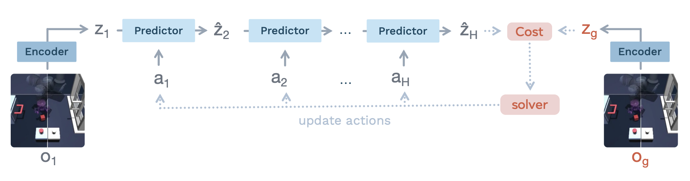

*Figure 4 — Cho quan sát ban đầu `o_1` và mục tiêu `o_g`, world model lập kế hoạch **ngay trong không gian latent**. Encoder cho ra `z_1` và `z_g`; predictor rollout các trạng thái tương lai tới horizon `H`; một hàm cost trong latent space dẫn đường cho solver cập nhật chuỗi hành động. Vòng lặp dự đoán–tối ưu này lặp cho tới khi hội tụ.*

## 3.1. Bài toán điều khiển tối ưu hữu hạn horizon

Sau khi train xong, world model được dùng như một **trình mô phỏng nhanh** để giải bài toán điều khiển:

```
C(ẑ_H) = ‖ẑ_H − z_g‖²₂ ,     z_g = enc_θ(o_g)                          (Eq. 4)

a*_1:H = argmin_{a_1:H}  C(ẑ_H)                                        (Eq. 5)
```

Ba điều cần nhấn mạnh:

- Cost chỉ so **trạng thái cuối cùng** với mục tiêu. Không có reward từng bước, không có hàm giá trị, không có gì phải học thêm.
- Trọng số của world model **được giữ cố định**. Biến duy nhất đang được tối ưu là **chuỗi hành động**.
- Toàn bộ vòng lặp diễn ra trong latent space 192 chiều. Không có ảnh nào được dựng lại. Đây là nguồn gốc của tốc độ.

## 3.2. CEM — solver không cần gradient

Paper dùng **Cross-Entropy Method (CEM)**, một thuật toán tối ưu **bậc không** (zero-order, tức chỉ cần đánh giá hàm mục tiêu chứ không cần đạo hàm của nó). Trực giác: CEM là một quy trình lấy mẫu lặp, mỗi vòng lại tinh chỉnh dần phân phối mà nó lấy mẫu từ đó.

Cụ thể từng vòng lặp:

1. Lấy mẫu **300 chuỗi hành động ứng viên** từ một phân phối Gaussian (khởi tạo `μ₀ = 0`, `Σ₀ = I`, phương sai ban đầu bằng 1).
2. Cho **từng ứng viên chạy trong world model** và tính cost của nó.
3. Chọn ra **30 ứng viên tốt nhất** — gọi là **elites**.
4. Tính lại `μ` và `Σ` từ tập elites này, dùng chúng làm phân phối lấy mẫu cho vòng sau.

Qua các vòng, phân phối lấy mẫu **co dần về vùng có cost thấp**. Số vòng lặp: **30** cho Push-T, **10** cho các môi trường còn lại. Kế hoạch cuối cùng là trung bình `μ` của vòng cuối.

Paper cũng thành thật nêu nhược điểm của CEM: trong bài toán **không lồi** (non-convex) thì **không có bảo đảm** nó hội tụ về nghiệm tối ưu toàn cục, và nó chịu ảnh hưởng nặng của **lời nguyền số chiều** — không gian hành động càng lớn thì CEM càng đuối.

Dù vậy, so sánh thực nghiệm (Table 10) cho thấy CEM **thắng xa** các solver dùng gradient trên bài này: CEM đạt 96.0%, Adam 84%, RMSProp 67.33%, SGD chỉ 26%.

## 3.3. MPC — vì sao phải lập kế hoạch lại liên tục

Horizon `H` là một sự đánh đổi: `H` lớn thì nhìn xa hơn nhưng tốn tính toán hơn **và** tích luỹ nhiều sai số hơn — vì rollout tự hồi quy nghĩa là sai số của bước này trở thành input sai của bước sau, càng đi xa càng lệch.

Để giảm tác hại đó, paper dùng **Model Predictive Control (MPC)** theo kiểu **receding horizon**: lập kế hoạch cho `H` bước, thực thi, rồi **quan sát lại môi trường thật và lập kế hoạch lại từ đầu**. Nhờ thế mỗi lần lập kế hoạch đều xuất phát từ một quan sát **thật**, chưa bị nhiễm sai số tích luỹ.

`H = 5` block, tương ứng **25 bước thật** của môi trường do frame-skip bằng 5. Setup này copy nguyên từ DINO-WM để so sánh cho công bằng.

> **Một điểm paper tự mâu thuẫn:** Mục 3.2 của bài viết "chỉ `K` hành động đầu tiên được thực thi trước khi lập kế hoạch lại", trong khi App. D lại viết "toàn bộ chuỗi hành động đã tối ưu được thực thi trước khi replan" (tức `K = H = 5`). Khi implement, nên theo App. D vì đó là phần mô tả chi tiết cấu hình thí nghiệm.

---

# Phần 4. Thí nghiệm và kết quả

## 4.1. Bốn môi trường

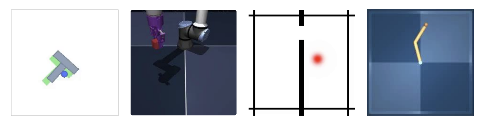

*Figure 5 — Từ trái sang: Push-T, OGBench-Cube, Two-Room, Reacher. Tất cả đều có không gian hành động liên tục.*

**Push-T** là bài toán thao tác (manipulation) 2D: một agent hình chấm tròn xanh phải **đẩy một khối hình chữ T** sao cho khớp với cấu hình đích. Đây là benchmark robotics khá phổ biến, và điểm khó là agent chỉ tương tác được qua động tác đẩy. Paper dùng đúng setup và dataset của DINO-WM: **20.000 episode chuyên gia**, độ dài trung bình 196 bước. World model train **10 epoch** — paper nói 10 epoch đã đủ để đạt kết quả tốt nhất, khớp với con số DINO-WM báo cáo.

**OGBench-Cube** là thao tác 3D: một cánh tay robot có end-effector phải **nhặt một khối lập phương và đặt vào vị trí đích**. Đây là môi trường **phức tạp về thị giác nhất** trong bốn môi trường. Paper chỉ dùng biến thể một khối, thu **10.000 episode × 200 bước** bằng heuristic thu thập dữ liệu có sẵn trong thư viện benchmark, train 10 epoch.

**Two-Room** là điều hướng (navigation) 2D: hai căn phòng ngăn bởi một bức tường có **đúng một cái cửa**; agent (chấm đỏ) phải đi từ vị trí ngẫu nhiên ở phòng này sang vị trí đích ở phòng kia, bắt buộc phải chui qua cửa. Đây là môi trường **đơn giản nhất**. Dữ liệu: **10.000 episode**, trung bình 92 bước, sinh bằng một **policy heuristic có nhiễu** (đi thẳng tới cửa trước, qua được phòng bên kia rồi mới đi tới đích).

**Reacher** lấy từ DeepMind Control Suite: một **cánh tay hai khớp** phải với tới cấu hình đích trên mặt phẳng 2D. Cần chú ý định nghĩa thành công ở đây khắt khe hơn ta tưởng: theo setup của DINO-WM, thành công được tính khi **các khớp của cánh tay khớp chính xác với cấu hình đích**, chứ không phải chỉ cần đầu tay chạm được đích. Dữ liệu: 10.000 episode × 200 bước, sinh bằng policy **Soft Actor-Critic**.

## 4.2. Các baseline được so sánh

- **DINO-WM** — world model dùng DINOv2 đóng băng làm encoder. Bản gốc của nó có dùng thêm proprioception; để so sánh công bằng, paper **loại bỏ proprioception** khỏi DINO-WM, và báo cáo bản có proprioception riêng dưới tên **DINO-WM+prop**.
- **PLDM** — baseline gần LeWM nhất, cũng end-to-end từ pixel, dùng objective 7 số hạng.
- **GCBC** (Goal-Conditioned Behavioral Cloning) — học bắt chước đơn giản: train policy để tái tạo hành động của chuyên gia.
- **GCIQL** và **GCIVL** — hai thuật toán reinforcement learning offline có điều kiện mục tiêu, dựa trên Implicit Q-Learning và Implicit Value Learning.
- **Random** — hành động ngẫu nhiên, làm mốc sàn.

> **Chi tiết đáng chú ý mà slide không nêu:** ba baseline GCBC, GCIQL, GCIVL đều mã hoá observation và goal bằng **DINOv2 patch embeddings**. Nghĩa là chúng được hưởng lợi từ một mô hình pretrain khổng lồ, trong khi LeWM học encoder từ con số không.

## 4.3. Giao thức đánh giá

Cách đánh giá được thiết kế để bảo đảm nhiệm vụ **luôn khả thi**: trạng thái ban đầu được lấy ngẫu nhiên từ một quỹ đạo trong dataset, còn trạng thái đích là trạng thái xảy ra **25 bước sau đó trong chính quỹ đạo ấy**. Như vậy chắc chắn tồn tại một chuỗi hành động đưa được từ đầu tới đích.

**Ngân sách đánh giá** là **50 bước** — agent được phép thực thi tối đa 50 hành động trong môi trường.

Một điểm mạnh cần nhấn mạnh khi trình bày: **hyperparameter được giữ nguyên cho mọi môi trường**, không tune riêng cho từng bài. Điều này khác hẳn PLDM, vốn phải chỉnh hệ số theo từng môi trường.

## 4.4. Kết quả planning, và cách đọc chúng cho đúng

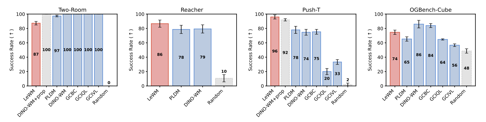

*Figure 6 — Tỉ lệ thành công (%) trên bốn môi trường.*

| Môi trường | LeWM | PLDM | DINO-WM | Nhận xét |
|---|---|---|---|---|
| Push-T | **96** | 78 | 74 (bản +prop: 92) | Thắng đậm, hơn cả bản DINO-WM có proprioception |
| Reacher | **86** | 78 | 79 | Thắng cả hai |
| OGBench-Cube | 74 | 65 | **86** | Thắng PLDM nhưng thua DINO-WM |
| Two-Room | 87 | 97 | **100** | Thua cả hai — chỗ này cần giải thích |

**Kết quả ấn tượng nhất là ở Push-T.** LeWM chỉ nhìn **pixel thuần tuý** mà vượt được DINO-WM **kể cả khi DINO-WM được cho thêm proprioception** (96 so với 92). Ý nghĩa: encoder của LeWM đã **tự học ra được những đại lượng liên quan tới nhiệm vụ** — những thứ mà DINO-WM phải được cung cấp sẵn từ cảm biến. Khoảng cách với PLDM là **18 điểm phần trăm**, đúng con số paper nêu trong abstract.

**Vì sao thua ở OGBench-Cube?** Paper giải thích rằng môi trường này **phức tạp về thị giác** và có bản chất **3D**, khiến việc train encoder từ đầu khó hơn hẳn. Ở đây, lợi thế "đã học từ 124 triệu ảnh" của DINOv2 phát huy tác dụng.

**Vì sao thua ở Two-Room — môi trường đơn giản nhất?** Đây là kết quả nghịch lý nhất và là chỗ hay nhất để hiểu bản chất SIGReg. Giải thích của tác giả: dataset của Two-Room có **độ đa dạng thấp** và **số chiều nội tại (intrinsic dimensionality) thấp** — cả môi trường thực chất chỉ có vài bậc tự do. Trong tình huống đó, việc **ép embedding phải khớp một Gaussian trong không gian nhiều chiều** là một đòi hỏi quá đáng: bạn đang bắt một cấu trúc vốn dĩ chỉ cần 2–3 chiều phải trải đều ra 192 chiều. Kết quả là latent bị **mất cấu trúc**.

Paper gọi đây là **giới hạn của chính SIGReg trong các môi trường có độ phức tạp rất thấp**. Đây là điều nên nói thẳng khi trình bày, vì nó cho thấy phương pháp có ranh giới rõ ràng chứ không phải liều thuốc chữa bách bệnh.

Một bằng chứng gián tiếp củng cố cách giải thích này: probing trên Two-Room (Table 3) cho thấy **latent của LeWM tốt ngang PLDM và tốt hơn hẳn DINO-WM**. Nghĩa là khoảng cách ở planning **không đến từ chất lượng representation** mà đến từ mô hình dynamics hoặc quy trình planning.

## 4.5. Chi phí tính toán — nơi LeWM thắng áp đảo

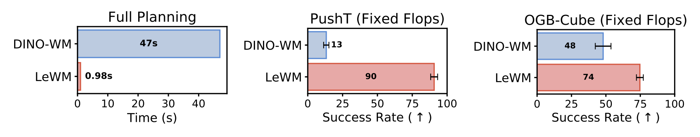

*Figure 3 — Trái: thời gian lập kế hoạch, trung bình 50 lần chạy. Giữa và phải: tỉ lệ thành công khi **khoá cùng một ngân sách FLOPs**.*

**Thời gian lập kế hoạch đầy đủ: 0.98 giây, so với 47 giây của DINO-WM** — nhanh hơn khoảng **48 lần**. Con số dưới một giây đưa phương pháp tiến gần tới ngưỡng **điều khiển thời gian thực**.

**Nguyên nhân gốc rễ của tốc độ:** LeWM mã hoá mỗi quan sát thành **ít hơn khoảng 200 lần số token** so với DINO-WM. DINO-WM giữ cả lưới patch token của DINOv2 cho mỗi ảnh, còn LeWM chỉ giữ **một vector [CLS] duy nhất**. Vì CEM phải rollout 300 ứng viên × 30 vòng lặp, chi phí mỗi lần rollout được nhân lên rất nhiều lần, nên việc giảm số token có tác động cực lớn lên tổng thời gian.

**So sánh dưới cùng ngân sách FLOPs** mới là so sánh đáng giá cho ứng dụng thực tế, vì trên robot thật bạn luôn bị giới hạn tài nguyên tính toán. Khi khoá cùng FLOPs:

- Push-T: LeWM **90%** so với DINO-WM **13%**
- OGBench-Cube: LeWM **74%** so với DINO-WM **48%**

Cách đọc: khi bị giới hạn compute, DINO-WM chỉ chạy được rất ít vòng CEM nên chất lượng kế hoạch sụp đổ (13%), trong khi LeWM vẫn lập kế hoạch đủ sâu. Nói cách khác, **latent gọn nhẹ không chỉ là chuyện tiết kiệm bộ nhớ, nó là một lợi thế ở cấp độ hệ thống**.

---

# Phần 5. Latent space có "hiểu" vật lý không?

Phần này của paper trả lời một câu hỏi khác với "model điều khiển có giỏi không". Câu hỏi ở đây là: **bên trong cái vector 192 chiều đó thật sự có gì?** Paper dùng bốn cách đo, mỗi cách nhìn từ một góc.

## 5.1. Probing — dò xem latent chứa đại lượng vật lý nào

**Probing là gì, nói cho dễ hiểu:** ta **đóng băng** encoder đã train, rồi train một **mô hình nhỏ** để đoán một đại lượng vật lý thật (ví dụ toạ độ của khối T) **từ vector latent**. Nếu mô hình nhỏ đó đoán được chính xác, kết luận là **thông tin ấy có nằm trong latent**; nếu đoán không nổi, thông tin ấy đã bị encoder vứt đi.

Paper dùng hai loại probe, và sự phân biệt giữa chúng rất có ý nghĩa:

- **Linear probe** (một phép biến đổi tuyến tính) trả lời: thông tin có **truy cập được một cách tuyến tính** không — tức nó có nằm "phơi ra" theo các hướng rõ ràng trong không gian latent không.
- **MLP probe** (mạng phi tuyến) trả lời: thông tin **có mặt** trong latent hay không, kể cả khi nó bị **rối (entangled)** và cần biến đổi phi tuyến mới moi ra được.

Hai chỉ số được báo cáo: **MSE** (càng thấp càng tốt) và **hệ số tương quan Pearson r** (càng gần 1 càng tốt).

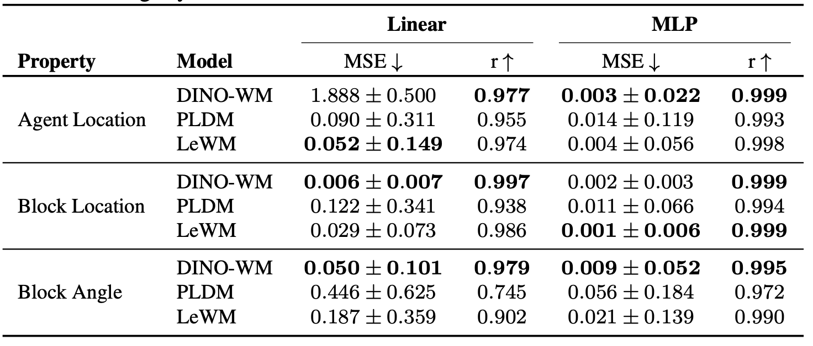

*Table 1 — Push-T: dò vị trí agent, vị trí khối, và góc quay của khối.*

**Kết quả tổng quát:** LeWM **thắng PLDM một cách đều đặn** trên mọi môi trường, và **cạnh tranh được với DINO-WM**. Điều này đáng chú ý hơn vẻ ngoài của nó: DINOv2 được pretrain trên khoảng **124 triệu ảnh**, nhiều hơn dữ liệu của LeWM **hai bậc độ lớn**, nên nó "biết sẵn" khá nhiều thuộc tính vật lý ngay từ đầu. Một model 15M tham số học từ vài chục nghìn episode mà bám kịp là kết quả tốt.

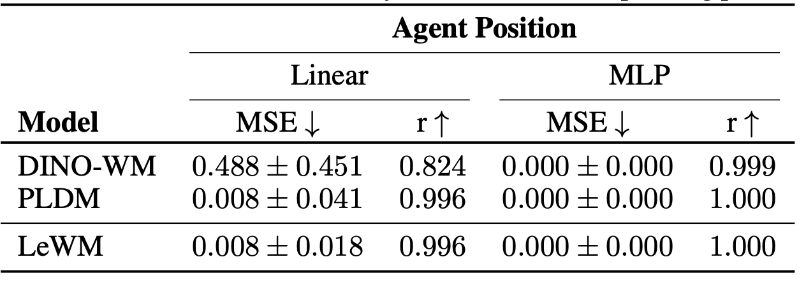

*Table 3 — Two-Room: LeWM và PLDM cùng đạt MSE 0.008 với r = 0.996 ở linear probe, trong khi DINO-WM chỉ đạt 0.488 với r = 0.824. Kết luận quan trọng: latent của LeWM ở môi trường này **không hề tệ**, nên khoảng cách ở planning phải đến từ nguyên nhân khác — dynamics hoặc solver.*

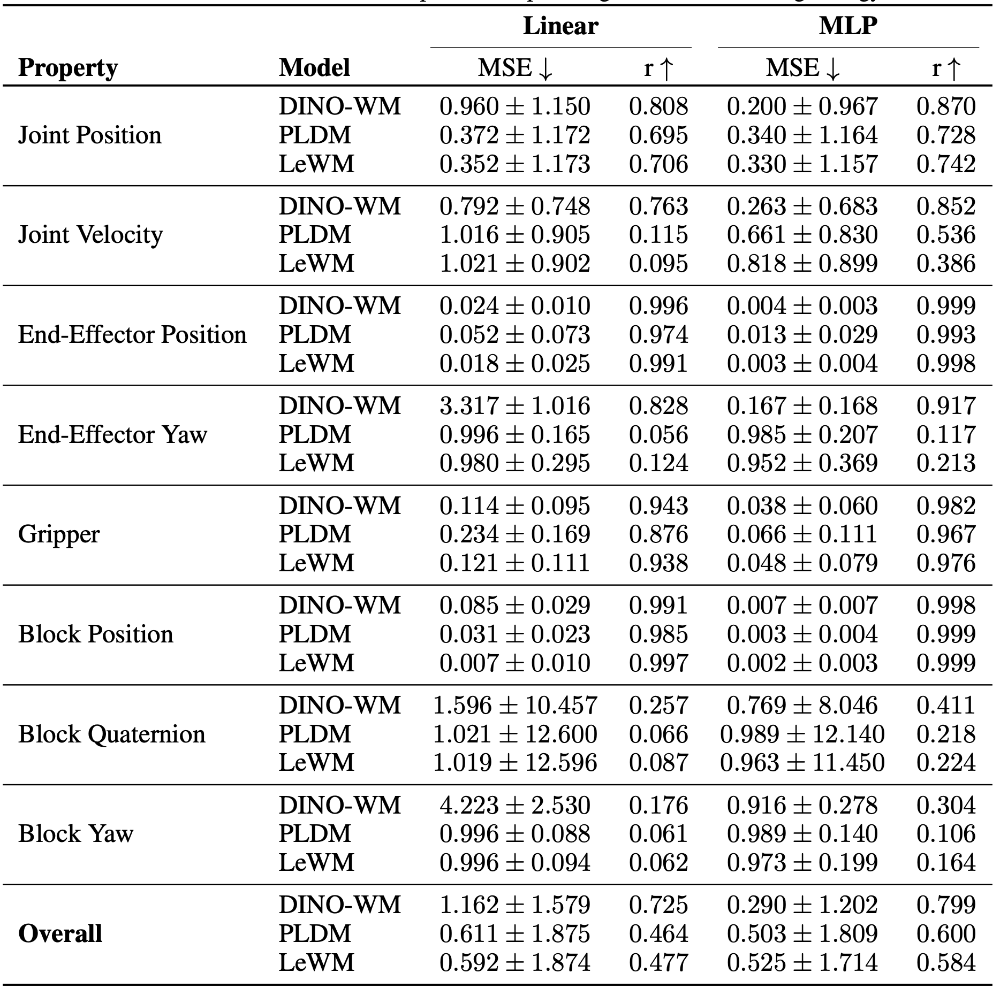

*Table 4 — OGBench-Cube: LeWM tốt nhất ở các đại lượng **vị trí** (vị trí khối: MSE 0.007 với r = 0.997; vị trí end-effector: 0.018). Nhưng DINO-WM giữ lợi thế rõ rệt ở các đại lượng **động và xoay** — vận tốc khớp (r 0.763 so với 0.095 của LeWM) và góc yaw của end-effector (r 0.828 so với 0.124).*

**Chỗ mà cả ba phương pháp đều thất bại: thông tin xoay.** Quaternion và góc yaw của khối gần như không phương pháp nào dò ra được (r chỉ trong khoảng 0.06–0.26). Paper nhận định rằng thông tin xoay chi tiết **rất khó nhét vào một latent space nhỏ gọn**, bất kể chiến lược train là gì. Đây là một hạn chế của cả lĩnh vực, không riêng LeWM.

## 5.2. Decode latent — model "tưởng tượng" ra cái gì

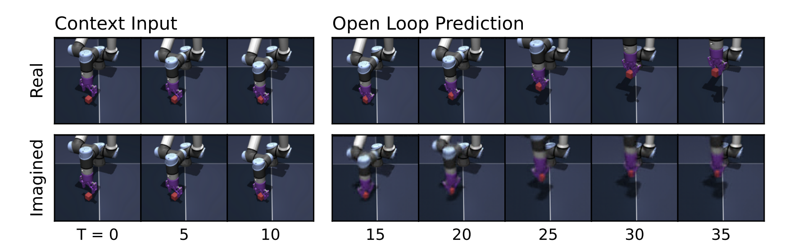

*Figure 7 — OGBench-Cube: ba frame đầu là ngữ cảnh thật, phần sau là rollout **open-loop**. Hàng trên là thực tế, hàng dưới là tưởng tượng của model (đã decode ra ảnh).*

Thí nghiệm này chạy như sau: cho model xem **3 frame ngữ cảnh**, sau đó **chỉ đưa hành động** và bắt nó tự sinh ra các latent tương lai — **không cho nó nhìn ảnh thật nữa**. Đây là ý nghĩa của chữ **open-loop**, và nó là một bài kiểm tra khắc nghiệt: model không có cơ hội tự sửa sai, mọi sai lệch đều tích luỹ.

**Kết quả:** latent giữ được **cấu trúc tổng thể của cảnh** và **chuyển động của khối lập phương** khá tốt. Nhưng những chi tiết mịn như **góc quay của end-effector** thì mất dần khi horizon kéo dài — điều này **khớp chính xác** với kết quả probing ở Table 4, nơi các đại lượng xoay có độ chính xác thấp nhất. Hai phương pháp đo độc lập cho cùng một kết luận, đó là dấu hiệu của một phát hiện đáng tin.

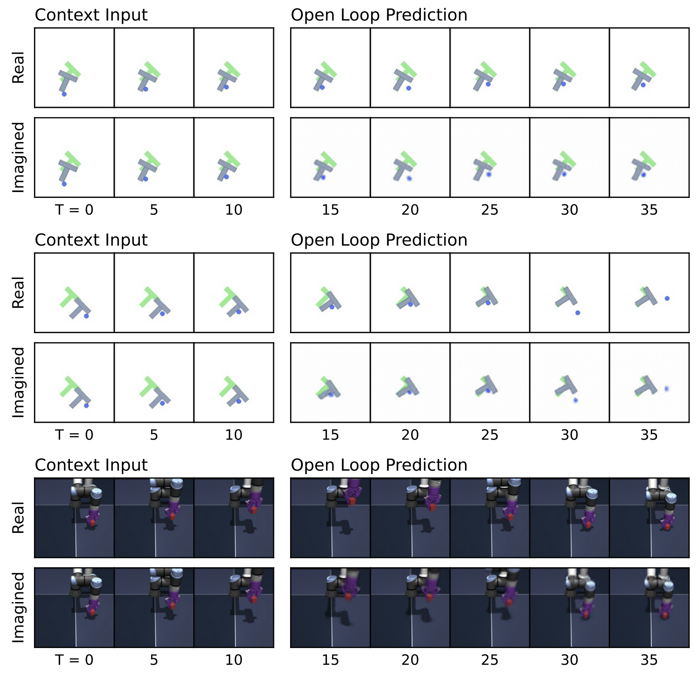

*Figure 9 — Thêm rollout. Trên Push-T, quỹ đạo tưởng tượng bám rất sát thực tế, cả chuyển động của agent lẫn của khối.*

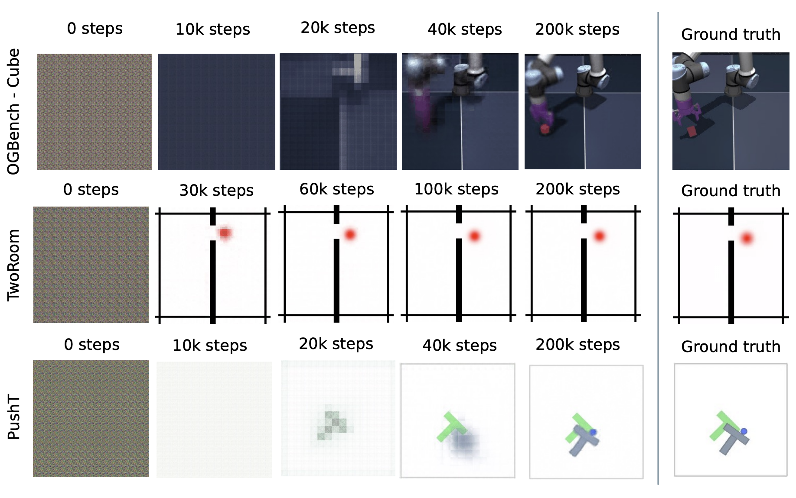

*Figure 10 — Ảnh decode từ latent qua các mốc train khác nhau (0 → 200k bước). Nhắc lại: **không có reconstruction loss nào** trong quá trình train world model.*

Đây là một trong hai hiện tượng **emergent** (tự nảy sinh) mà paper nêu. Càng train, decoder càng dựng lại được ảnh chính xác hơn — **mặc dù tái tạo ảnh chưa bao giờ là mục tiêu**. Điều này chứng tỏ vector **192 chiều** ấy đã giữ đủ thông tin về trạng thái vật lý của cảnh, chỉ đơn thuần nhờ sức ép "phải dự đoán được tương lai".

Một chi tiết thú vị ở giai đoạn đầu: ảnh decode ra ban đầu tương ứng với **slow features** — những thành phần biến đổi **chậm nhất** trong cảnh (ví dụ nền, tường) — rồi các thành phần nhanh mới xuất hiện sau. Hiện tượng này đã được báo cáo trong nghiên cứu JEPA trước đó ("JEPAs Focus on Slow Features").

## 5.3. Nhìn latent bằng t-SNE

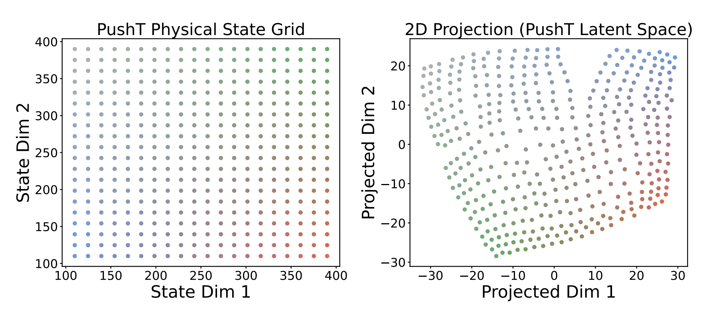

*Figure 13 — Bên trái là lưới trạng thái vật lý thật (agent và khối di chuyển trên mặt phẳng x-y), bên phải là các embedding tương ứng chiếu xuống 2D bằng t-SNE.*

Cách đọc hình này: nếu latent space có cấu trúc tốt thì các điểm **gần nhau trong thực tế** phải **gần nhau trong latent**, và cấu trúc lưới phải được bảo toàn. Hình cho thấy đúng như vậy: **quan hệ lân cận và vị trí tương đối được giữ lại**, dù có bị biến dạng (lưới vuông thành hình cong). Đây là bằng chứng định tính bổ sung cho probing.

## 5.4. Temporal latent path straightening — quỹ đạo latent tự duỗi thẳng

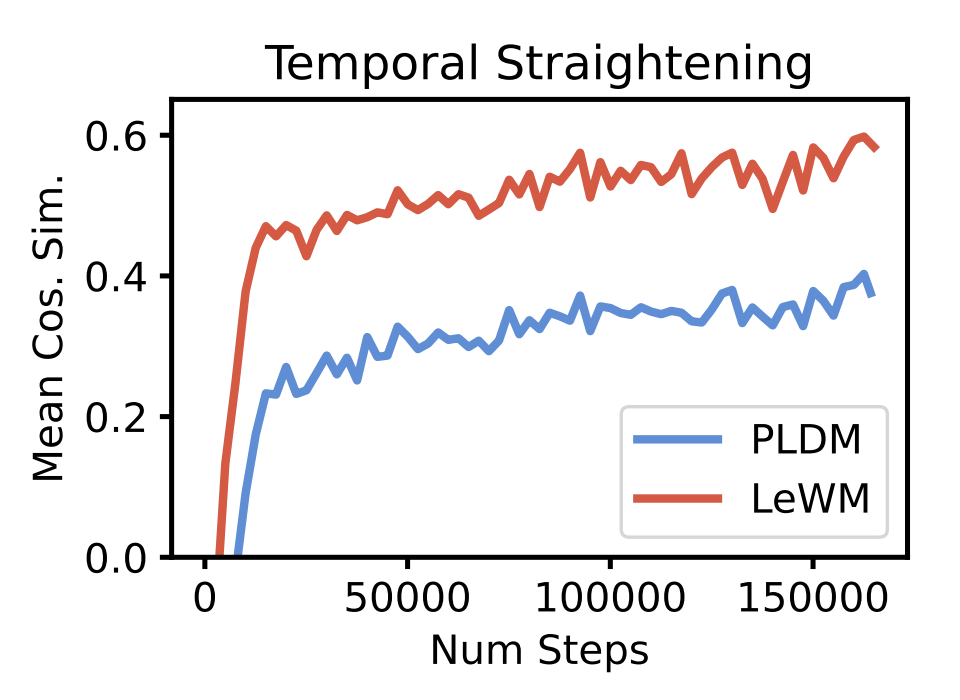

*Figure 17 — Độ thẳng của quỹ đạo latent trên Push-T theo thời gian train. LeWM (đỏ) đạt khoảng 0.6, PLDM (xanh) khoảng 0.4.*

Đây là hiện tượng emergent thứ hai, và là phần bất ngờ nhất của paper.

**Giả thuyết duỗi thẳng theo thời gian (temporal straightening hypothesis)** đến từ **khoa học thần kinh** (Hénaff, Goris & Simoncelli, Nature Neuroscience 2019). Nội dung: não bộ biểu diễn các động lực phức tạp của thế giới bằng những quỹ đạo **trơn và gần như thẳng** trong không gian biểu diễn của nó. Ý tưởng này về sau được dùng cả ngoài thần kinh học — có nhóm dùng độ thẳng đo từ đặc trưng DINOv2 để **phân biệt video do AI sinh ra với video thật**.

**Cách đo:** định nghĩa vector vận tốc trong latent là `v_t = z_{t+1} − z_t`, rồi tính **cosine similarity trung bình giữa các vector vận tốc liên tiếp**:

```
𝒮_straight = (1/(B(T−2))) Σ_i Σ_t  ⟨v_t^(i), v_{t+1}^(i)⟩ / (‖v_t^(i)‖·‖v_{t+1}^(i)‖)      (Eq. 9)
```

Giá trị gần 1 nghĩa là các vận tốc liên tiếp gần như cùng phương — quỹ đạo latent gần **một đường thẳng**.

**Phát hiện bất ngờ:** LeWM đạt độ thẳng **cao hơn hẳn PLDM**, mặc dù **PLDM có hẳn một số hạng loss riêng** (`𝓛_time-sim`) để ép quỹ đạo trơn theo thời gian, còn **LeWM không có gì cả**.

**Giả thuyết của tác giả về nguyên nhân:** SIGReg được áp **độc lập tại từng bước thời gian**, **không** ràng buộc gì theo chiều thời gian. Chiều thời gian vì thế được để "tự do", và encoder trôi về một dạng **temporal collapse nhẹ** — các embedding liên tiếp tiến hoá theo những đường ngày càng tuyến tính. Điều đáng nói là **sự thiên lệch ngầm này không có hại, thậm chí có lợi** cho planning: một quỹ đạo latent gần thẳng thì dễ ngoại suy và dễ tối ưu hơn nhiều.

Đây là một ví dụ hay về chuyện *một ràng buộc bị bỏ sót lại hoá ra là điều tốt* — và cũng là một câu hỏi mở thú vị: nếu thêm SIGReg theo chiều thời gian thì có mất luôn ưu điểm này không?

## 5.5. Violation-of-Expectation — model có biết "ngạc nhiên" không?

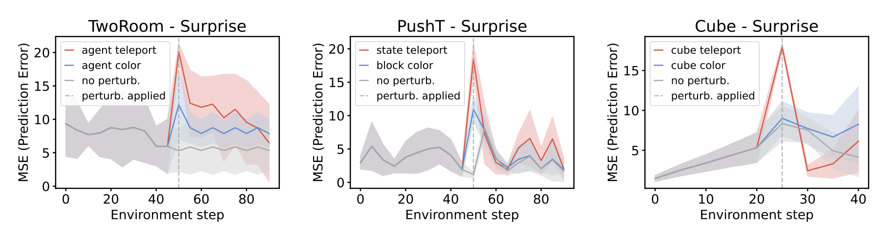

*Figure 8 — Mức độ "ngạc nhiên" (đo bằng MSE dự đoán) theo thời gian, trên ba môi trường: Two-Room, Push-T, OGBench-Cube. Mỗi hình có ba đường: quỹ đạo không nhiễu, quỹ đạo bị nhiễu thị giác, và quỹ đạo bị nhiễu vật lý.*

**Ý tưởng của paradigm này** đến từ **tâm lý học phát triển**. Khi nghiên cứu trẻ sơ sinh, nhà tâm lý học không thể hỏi đứa trẻ hiểu gì; thay vào đó họ cho nó xem những cảnh **phi vật lý** (một vật biến mất, một vật xuyên qua tường) và **đo xem nó nhìn lâu hơn bao nhiêu**. Nhìn lâu hơn nghĩa là ngạc nhiên, mà ngạc nhiên nghĩa là **nó có kỳ vọng** — tức là nó hiểu quy luật.

Áp dụng cho world model: **"ngạc nhiên" được đo bằng sai số giữa dự đoán của model và thực tế quan sát được**. Một model thật sự hiểu vật lý thì phải **ngạc nhiên nhiều hơn khi thấy chuyện trái quy luật vật lý** so với khi thấy chuyện chỉ lạ mắt.

Paper tạo hai loại nhiễu để phân biệt hai chuyện đó:

- **Nhiễu thị giác (visual perturbation):** một vật thể **đổi màu** đột ngột giữa chừng. Lạ mắt, nhưng **không vi phạm quy luật vật lý** nào.
- **Nhiễu vật lý (physical perturbation):** một hoặc nhiều vật thể **dịch chuyển tức thời (teleport)** tới vị trí ngẫu nhiên. Chuyện này **phá vỡ tính liên tục vật lý** — vật thể không thể nhảy tức thời qua không gian.

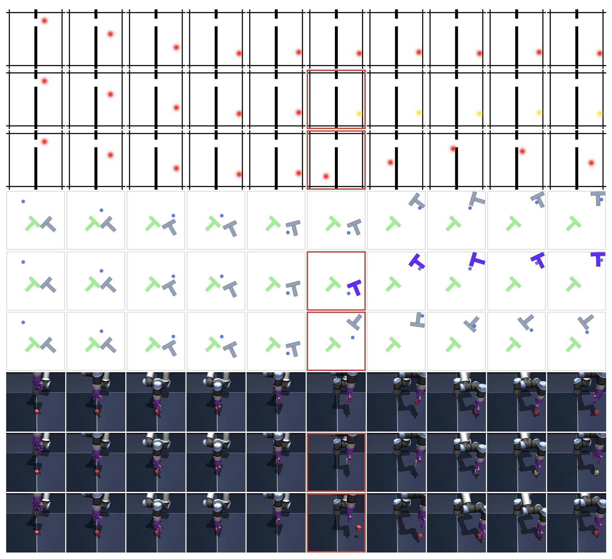

*Figure 11 — Ví dụ quỹ đạo cho thí nghiệm VoE. Hàng 1: không nhiễu. Hàng 2: nhiễu thị giác (đổi màu). Hàng 3: nhiễu vật lý (teleport). Frame xảy ra nhiễu được khoanh đỏ.*

**Kết quả của LeWM:** độ ngạc nhiên **tăng vọt rất mạnh khi có teleport**, và mức tăng này **có ý nghĩa thống kê ở cả ba môi trường** (paired t-test, **p < 0.01**). Ngược lại, phản ứng với việc đổi màu **yếu hơn và không có ý nghĩa thống kê**.

Kết luận: model **nhạy với vi phạm vật lý hơn là vi phạm thị giác** — đúng thứ ta muốn ở một world model. Nó không chỉ ghi nhớ bề ngoài của cảnh mà đã nắm được điều gì đó về quy luật vận động.

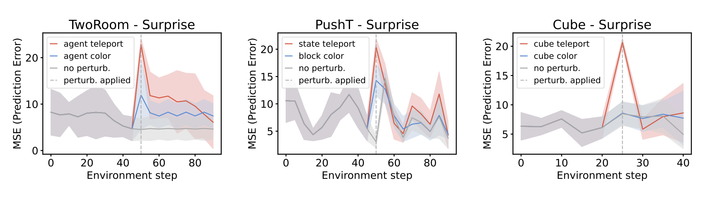

*Figure 12 — PLDM: ở Two-Room và Push-T, model gán độ ngạc nhiên cao có ý nghĩa cho **cả hai** loại nhiễu, tức nó **không phân biệt được** vi phạm vật lý với vi phạm thị giác. Ở OGBench-Cube, tín hiệu yếu và không nhất quán.*

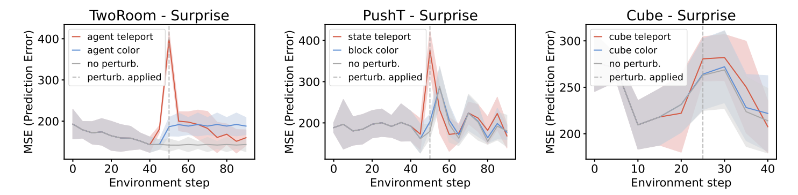

*Figure 14 — DINO-WM: phát hiện được **cả hai** loại nhiễu ở Two-Room và Push-T (cũng không phân biệt được), còn ở OGBench-Cube thì **không** tăng ngạc nhiên đáng kể với bất kỳ loại nhiễu nào.*

So sánh ba hình lại với nhau mới thấy điểm mạnh của LeWM nằm ở đâu: không phải ở chỗ "biết ngạc nhiên" (cả ba đều biết, ở môi trường đơn giản), mà ở chỗ **ngạc nhiên có chọn lọc** — phản ứng mạnh với cái sai về bản chất, phản ứng nhẹ với cái chỉ khác về bề ngoài.

---

# Phần 6. Tính ổn định và các ablation

## 6.0. "Ổn định" ở đây nghĩa chính xác là gì

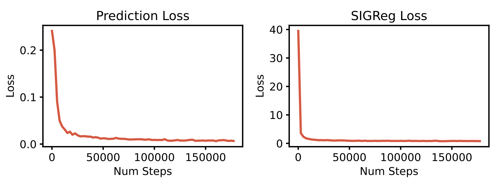

*Figure 18 — Đường loss của LeWM trên Push-T. Prediction loss giảm **đều và đơn điệu**; SIGReg loss tụt rất nhanh ở giai đoạn đầu rồi đi ngang, cho thấy phân phối latent **đạt tới Gaussian rất sớm** rồi giữ nguyên ở đó.*

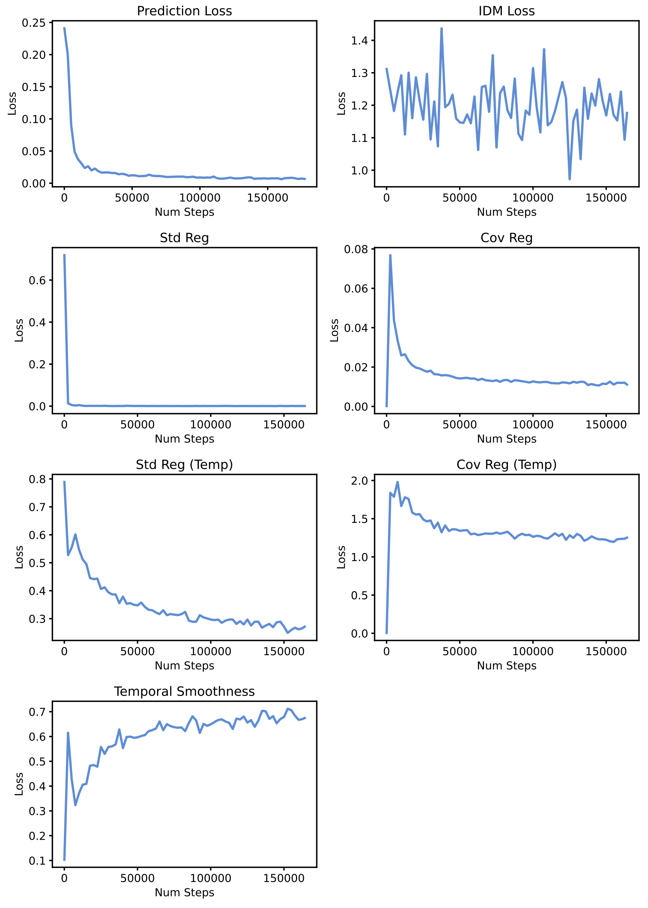

*Figure 19 — Đường loss của PLDM: bảy thành phần, nhiều thành phần **dao động và không đơn điệu**. Riêng IDM loss dao động loạn xạ suốt quá trình train, còn temporal smoothness thì lại **tăng** dần.*

Hai hình này đặt cạnh nhau là lập luận trực quan nhất của paper. Nhưng "ổn định" không chỉ là "đồ thị nhìn đẹp". Paper chứng minh nó theo bốn nghĩa cụ thể:

1. **Đường loss đơn điệu** — không dao động, không cần cân bằng gradient của nhiều regularizer đánh nhau.
2. **Phương sai thấp giữa các seed.** Table 5 (3 seed, cùng 50 quỹ đạo trên Push-T): LeWM **96.0 ± 2.83**, DINO-WM 92.0 ± 1.63, PLDM **78.0 ± 5.0**. PLDM vừa kém hơn vừa thất thường hơn.
3. **Bền vững với thay đổi kiến trúc và hyperparameter** — xem các ablation bên dưới.
4. **Tune được bằng bisection search `O(log n)`** thay vì grid search `O(n⁶)`.

## 6.1. Những thứ thật sự quan trọng

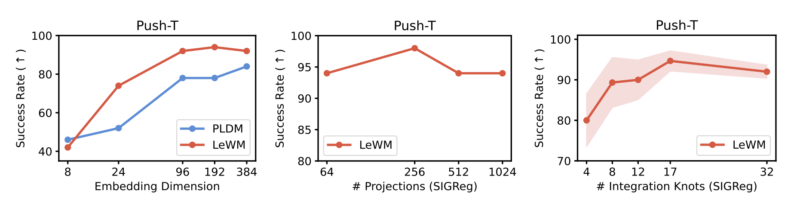

*Figure 15 — Trái: ảnh hưởng của số chiều embedding. Giữa: số hướng chiếu ngẫu nhiên `M` trong SIGReg. Phải: số nút tích phân (integration knots).*

**Số chiều embedding — quan trọng, nhưng chỉ tới một ngưỡng.** Hiệu năng **tụt rõ** nếu số chiều xuống dưới khoảng **184**, nhưng tăng lên trên ngưỡng đó thì lợi ích giảm dần rất nhanh và **bão hoà**. Nghĩa là bạn cần "đủ chỗ" để chứa thông tin, nhưng không cần chọn con số này cho thật chuẩn.

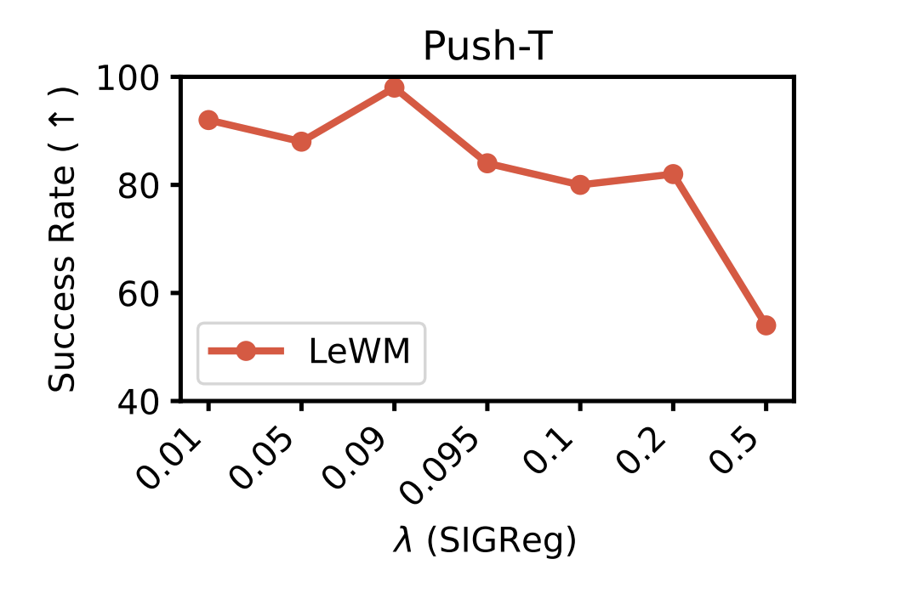

*Figure 16 — Ảnh hưởng của trọng số `λ`. Tỉ lệ thành công giữ **trên 80% với `λ ∈ [0.01, 0.2]`**, đỉnh quanh **`λ = 0.09`**. Chỉ tới `λ = 0.5` hiệu năng mới sụp mạnh.*

**Trọng số `λ` — hyperparameter thật sự duy nhất, nhưng có vùng an toàn rộng.** Lý do nó sụp ở `λ = 0.5`: khi regularizer quá nặng, nó **đè bẹp prediction loss**, model lo làm cho embedding thành Gaussian đẹp mà quên mất việc học dynamics. Vùng plateau rộng từ 0.01 tới 0.2 chính là điều làm cho bisection search hoạt động được.

**Kích thước predictor — có ảnh hưởng đáng kể** (Table 6, đo trên Push-T):

| Kích thước predictor | Tỉ lệ thành công |
|---|---|
| ViT-Tiny | 80.67 ± 6.54 |
| **ViT-Small** | **96.0 ± 2.83** |
| ViT-Base | 86.7 ± 3.06 |

ViT-S là điểm cân bằng tốt nhất: Tiny **thiếu capacity** để mô hình hoá dynamics, còn Base thì **khó tối ưu hơn** nên lại kém đi. Đây là mẫu hình quen thuộc — to hơn không phải lúc nào cũng tốt hơn khi dữ liệu có hạn.

**Dropout trong predictor — ảnh hưởng lớn hơn bạn tưởng** (Table 9):

| Dropout `p` | Tỉ lệ thành công |
|---|---|
| 0.0 | 78 ± 6.54 |
| **0.1** | **96.0 ± 2.83** |
| 0.2 | 85.33 ± 5.74 |
| 0.5 | 66.67 ± 4.11 |

Chênh lệch giữa `p = 0` và `p = 0.1` là **18 điểm phần trăm** — bằng đúng khoảng cách giữa LeWM và PLDM. Dropout nhẹ giúp predictor **tổng quát hoá** tốt hơn; dropout quá mạnh thì **phá hỏng mô hình dynamics**. Nếu implement lại mà quên dropout, bạn sẽ mất gần hết lợi thế của phương pháp.

**Thêm reconstruction loss — làm mọi thứ tệ đi** (Table 7): không decoder loss đạt **96.0 ± 2.83**, có decoder loss chỉ còn **86.0 ± 7.54** (và phương sai tăng gấp gần ba lần).

Kết quả này **xác nhận đúng triết lý của JEPA**: bắt model tái tạo ảnh là bắt nó dành dung lượng cho những chi tiết thị giác **không liên quan tới việc điều khiển**. Objective JEPA tự nó đã giữ đúng phần thông tin cần cho planning rồi.

**Kiến trúc encoder — gần như không quan trọng** (Table 8): ViT đạt 96.0 ± 2.83, ResNet-18 đạt 94.0 ± 3.27. Chênh lệch nhỏ, chứng tỏ phương pháp **không phụ thuộc vào lựa chọn backbone thị giác**. Đây là tin tốt cho tính tổng quát: SIGReg không phải một mẹo chỉ hợp với transformer.

**Solver dùng khi planning — quan trọng rất nhiều** (Table 10, Push-T):

| Solver | LeWM | PLDM |
|---|---|---|
| **CEM** | **96.0 ± 2.83** | 78.0 ± 5.0 |
| Adam | 84 ± 7.12 | 80 ± 3.27 |
| RMSProp | 67.33 ± 2.49 | 49.33 ± 8.26 |
| SGD | 26 ± 4.32 | 4.67 ± 0.06 |

Hai điều rút ra: **CEM (lấy mẫu, không dùng gradient) thắng xa các solver dựa trên gradient** trên bài toán này; và **LeWM tốt hơn PLDM với mọi solver**, nghĩa là lợi thế của nó không phải nhờ ăn may với một solver cụ thể.

## 6.2. Những thứ hoá ra không quan trọng

**Số hướng chiếu `M` trong SIGReg** (Fig. 15, giữa): thay đổi từ 64 lên 1024, hiệu năng gần như không đổi (dao động trong khoảng 90–97%). Đây là kết quả quan trọng về mặt lập luận, vì nó là thứ cho phép paper nói "chỉ có một hyperparameter" — về hình thức `M` là hyperparameter thứ hai, nhưng thực tế nó **không cần tune**.

**Số nút tích phân (integration knots)** dùng khi tính xấp xỉ tích phân Epps–Pulley (Fig. 15, phải): cũng gần như không ảnh hưởng, miễn là không quá ít.

**Ý nghĩa tổng hợp:** hai tham số nội bộ của SIGReg đều **vô hại**, nên lời hứa "một hyperparameter" là **có căn cứ thực nghiệm** chứ không phải cách nói cho đẹp. Và `λ` — cái duy nhất còn lại — thì có plateau rộng. Phần ablation này chính là phần **chứng minh** lời hứa lớn nhất của paper.

## 6.3. Ba chi tiết dễ làm sai khi implement lại

Nếu bạn định code lại LeWM, ba chỗ sau ảnh hưởng lớn tới kết quả nhưng rất dễ bị bỏ qua:

1. **Projection kèm BatchNorm sau token [CLS]** — thiếu nó thì LayerNorm cuối của ViT sẽ khiến SIGReg không tối ưu được.
2. **Dropout 0.1 ở predictor** — thiếu nó, hiệu năng rơi từ 96% xuống 78%.
3. **AdaLN khởi tạo bằng 0** — để ảnh hưởng của hành động tăng dần thay vì đổ ập vào từ bước train đầu tiên.

---

# Phần 7. Hạn chế, đóng góp và câu hỏi mở

## 7.1. Hạn chế (do chính tác giả nêu)

- **Chỉ lập kế hoạch được ở horizon ngắn** (`H = 5`). Rollout tự hồi quy tích luỹ sai số, nên nhìn càng xa càng lệch. Đây là hạn chế cơ bản nhất.
- **Phụ thuộc vào việc dataset offline phủ đủ dynamics.** Khi dữ liệu ít đa dạng, SIGReg yếu đi rõ rệt — ca Two-Room là minh chứng cụ thể: ép khớp một Gaussian nhiều chiều là chuyện khó khi môi trường vốn dĩ có ít bậc tự do.
- **Cần nhãn hành động** cho từng bước dữ liệu. Điều này giới hạn khả năng tận dụng video thô trên mạng (video thì đầy, nhưng không kèm nhãn hành động).
- **Kém DINO-WM ở môi trường 3D phức tạp về thị giác** — train encoder từ đầu khó hơn dùng foundation model.
- **Không encode được các đại lượng xoay** (quaternion, yaw) — dù đây là hạn chế chung của cả ba phương pháp được so sánh.

## 7.2. Hướng phát triển được đề xuất

- **World model phân cấp (hierarchical)** để suy luận ở horizon dài: một tầng lập kế hoạch thô ở mức trừu tượng cao, một tầng chi tiết ở mức thấp.
- **Pretrain trên tập video lớn và đa dạng** để có prior mạnh hơn, giảm nhu cầu thu dữ liệu riêng cho từng domain.
- **Mô hình động lực ngược (inverse dynamics model)** để thoát khỏi sự phụ thuộc vào nhãn hành động — nếu suy ra được hành động từ hai frame liên tiếp thì có thể học từ video không nhãn.

## 7.3. Ba đóng góp, gói lại thành ba câu

1. **Về phương pháp:** đây là JEPA đầu tiên train được **ổn định, end-to-end, từ pixel thô**, với objective chỉ **hai số hạng**, bền vững trước thay đổi kiến trúc và hyperparameter, và tune được trong **thời gian logarit**.
2. **Về điều khiển:** chỉ **15M tham số** mà cạnh tranh được trên cả bài toán 2D lẫn 3D, **vượt** các JEPA end-to-end trước đó, và lập kế hoạch **nhanh hơn tới 48 lần** so với world model dựa trên foundation model.
3. **Về hiểu biết vật lý:** đưa ra cách đánh giá latent space bằng **probing các đại lượng vật lý** cộng với **violation-of-expectation**, thay vì chỉ nhìn điểm số điều khiển.

## 7.4. Vài câu hỏi đáng tự đặt ra khi học

- Nếu SIGReg ép Gaussian trong không gian nhiều chiều mà môi trường lại có **số chiều nội tại thấp**, thì có nên **giảm số chiều embedding theo từng môi trường** không? Fig. 15 (trái) gợi ý rằng có, và điều đó có thể sửa được ca Two-Room.
- Temporal straightening là **lỗi hay tính năng**? Nếu thêm SIGReg theo cả chiều thời gian để "làm cho đúng", liệu có mất luôn ưu điểm này không?
- Bảo đảm chống collapse dựa trên **Cramér–Wold** là bảo đảm **tiệm cận theo `M`**. Với `M = 1024` hữu hạn, bảo đảm ấy còn chặt tới mức nào? Ablation cho thấy `M = 64` cũng chạy tốt — vậy lý thuyết đang nói quá, hay thực nghiệm đang may mắn?
- CEM không có bảo đảm hội tụ toàn cục và chịu lời nguyền số chiều. Với không gian hành động lớn hơn (robot nhiều bậc tự do), liệu điểm nghẽn có chuyển từ world model sang solver không?

---

# Phần 8. Từ điển thuật ngữ

Các thuật ngữ dưới đây được giữ nguyên tiếng Anh trong tài liệu vì đó là cách chúng xuất hiện trong paper và trong mọi tài liệu liên quan.

**JEPA (Joint-Embedding Predictive Architecture)** — kiến trúc dự đoán **embedding** của tương lai thay vì dự đoán **pixel** của tương lai. Nhờ dự đoán trong không gian nén, model không bị buộc phải mô hình hoá những chi tiết thị giác vô nghĩa.

**Representation collapse** — trạng thái hỏng trong đó encoder ánh xạ mọi input về (gần như) cùng một vector. Loss dự đoán rất thấp nhưng representation hoàn toàn vô dụng. Đây là bệnh trung tâm của JEPA.

**SIGReg (Sketched-Isotropic-Gaussian Regularizer)** — regularizer ép phân phối embedding về `𝒩(0, I)`. Chữ "sketched" phản ánh việc nó không kiểm tra phân phối nhiều chiều một cách trực tiếp, mà chỉ **phác thảo** qua nhiều phép chiếu ngẫu nhiên xuống một chiều.

**Isotropic Gaussian** — phân phối Gaussian có ma trận hiệp phương sai bằng ma trận đơn vị: "tròn đều" theo mọi hướng, phương sai mỗi chiều bằng 1. Chính tính chất phương sai luôn dương này là thứ khiến collapse trở nên bất khả thi.

**Định lý Cramér–Wold** — nếu **mọi** phân phối biên một chiều của hai phân phối nhiều chiều trùng nhau thì hai phân phối joint trùng nhau. Đây là nền tảng lý thuyết cho phép SIGReg chỉ cần kiểm tra các chiếu một chiều.

**Epps–Pulley test** — một phép kiểm định tính chuẩn cho dữ liệu một chiều, dựa trên việc so sánh **hàm đặc trưng thực nghiệm (ECF)** của mẫu với hàm đặc trưng của phân phối chuẩn.

**VICReg (Variance-Invariance-Covariance Regularization)** — phương pháp chống collapse bằng cách điều chỉnh phương sai và hiệp phương sai của embedding, tức chỉ ràng buộc **moment bậc hai**. Vì thế nó **under-specified**: nhiều phân phối không mong muốn vẫn thoả mãn.

**EMA + stop-gradient** — cặp heuristic phổ biến để chống collapse: giữ một bản encoder "giáo viên" cập nhật bằng trung bình trượt và chặn gradient qua nhánh đó. Chạy được nhưng **không tương ứng với việc tối thiểu hoá một objective xác định**, nên khó phân tích.

**MPC (Model Predictive Control)** — chiến lược điều khiển: lập kế hoạch cho một đoạn ngắn phía trước, thực thi, rồi **lập kế hoạch lại** từ quan sát mới. Mục đích là không để sai số dự đoán tích luỹ quá lâu.

**CEM (Cross-Entropy Method)** — thuật toán tối ưu **bậc không**: lấy mẫu nhiều phương án, giữ lại nhóm **top-K tốt nhất (elites)**, cập nhật `μ` và `Σ` của phân phối lấy mẫu theo nhóm đó, rồi lặp lại.

**Teacher forcing** — cách train trong đó model luôn được cho xem **giá trị thật** `z_t` ở bước trước, thay vì phải dùng chính dự đoán của nó. Giúp train ổn định nhưng tạo ra khác biệt so với lúc chạy thật.

**Open-loop rollout** — sinh chuỗi tương lai **chỉ từ hành động**, không được nhìn lại quan sát thật. Đây là bài kiểm tra khắc nghiệt cho chất lượng mô hình dynamics vì model không có cơ hội tự sửa sai.

**AdaLN (Adaptive Layer Normalization)** — kỹ thuật đưa một điều kiện (ở đây là hành động) vào mạng bằng cách để nó sinh ra hệ số scale và shift cho LayerNorm. Khởi tạo bằng 0 để ảnh hưởng của điều kiện tăng dần trong quá trình train.

**Probing** — đóng băng representation rồi train một model nhỏ để đoán một đại lượng cụ thể, nhằm đo xem thông tin đó có nằm trong representation hay không. Linear probe đo tính **truy cập tuyến tính**, MLP probe đo **sự hiện diện** của thông tin.

**Violation-of-Expectation (VoE)** — paradigm mượn từ tâm lý học phát triển: đo mức độ "ngạc nhiên" của model trước những sự kiện phi vật lý, để suy ra nó có kỳ vọng đúng về quy luật vật lý hay không.

**Slow features** — những thành phần biến đổi **chậm** trong cảnh. JEPA có xu hướng học chúng trước, rồi mới học các thành phần biến đổi nhanh.

**Reward-free / offline** — chỉ có dữ liệu `(quan sát, hành động)`, **không** có tín hiệu thưởng và **không** được tương tác thêm với môi trường.

**Intrinsic dimensionality (số chiều nội tại)** — số chiều thật sự cần để mô tả dữ liệu, thường nhỏ hơn nhiều số chiều danh nghĩa. Two-Room có số chiều nội tại rất thấp, và đó là lý do SIGReg gặp khó ở đó.

---

# Phần 9. Tài liệu nên đọc thêm

## 9.1. Lộ trình đọc gợi ý

① LeCun's path (bức tranh lớn) → ② LeJEPA (chính là nguồn của SIGReg) → ③ DINO-WM và PLDM (hai baseline trực tiếp) → ④ VICReg cùng I-JEPA/V-JEPA (bối cảnh chống collapse) → ⑤ CEM và Cramér–Wold/Epps–Pulley (công cụ toán học).

## 9.2. Bắt buộc đọc nếu muốn hiểu paper này

- **[25] Balestriero & LeCun — LeJEPA: Provable and Scalable SSL without the Heuristics** (2025), [arxiv.org/abs/2511.08544](https://arxiv.org/abs/2511.08544). Đây là **nguồn gốc của SIGReg** và là tài liệu quan trọng nhất trong danh sách này. Có thể hiểu LeWM là "đưa LeJEPA vào world model có điều kiện hành động".
- **[5] LeCun — A Path Towards Autonomous Machine Intelligence** (2022), [OpenReview](https://openreview.net/forum?id=BZ5a1r-kVsf). Position paper khai sinh JEPA. Đọc để hiểu **vì sao lại là latent chứ không phải pixel**.
- **[18] Zhou, Pan, LeCun, Pinto — DINO-WM: World Models on Pre-trained Visual Features** (ICML 2025), [arxiv.org/abs/2411.04983](https://arxiv.org/abs/2411.04983). Baseline foundation-model. LeWM mượn **nguyên setup planning** (CEM, horizon, dataset Push-T) từ đây, nên đọc nó sẽ hiểu rõ phần thí nghiệm.
- **[22] Sobal, Zhang, Cho, Balestriero, Rudner, LeCun — Stress-testing Offline Reward-free RL: Planning with Latent Dynamics (PLDM)** (2025), [OpenReview](https://openreview.net/forum?id=jON7H6A9UU). Baseline end-to-end gần nhất — chính là "objective 7 số hạng" mà LeWM thay thế.
- **[23] Bardes, Ponce, LeCun — VICReg** (ICLR 2022), [OpenReview](https://openreview.net/forum?id=xm6YD62D1Ub). Hiểu VICReg mới thấy rõ vì sao nó under-specified so với SIGReg.
- **[21] Sobal et al. — JEPAs Focus on Slow Features** (2022), [arxiv.org/abs/2211.10831](https://arxiv.org/abs/2211.10831). Giải thích hiện tượng "ảnh decode giai đoạn đầu chỉ ra slow features" ở Fig. 10.

## 9.3. Công cụ toán học và thuật toán bên trong phương pháp

- **[39] Cramér & Wold — Some Theorems on Distribution Functions** (1936). Định lý bảo đảm "khớp mọi marginal 1-D ⟹ khớp joint".
- **[38] Epps & Pulley — A Test for Normality Based on the Empirical Characteristic Function**, Biometrika 70(3), 1983. Thống kê `T(·)` mà SIGReg tối thiểu hoá.
- **[40] Rubinstein & Kroese — The Cross-Entropy Method** (Springer, 2004). Solver dùng khi planning.
- **[34] Dosovitskiy et al. — ViT: An Image is Worth 16×16 Words**, [arxiv.org/abs/2010.11929](https://arxiv.org/abs/2010.11929). Backbone của encoder.
- **[37] Peebles & Xie — DiT: Scalable Diffusion Models with Transformers** (ICCV 2023), [arxiv.org/abs/2212.09748](https://arxiv.org/abs/2212.09748). Nguồn của kỹ thuật AdaLN.
- **[35][36] BatchNorm** ([1502.03167](https://arxiv.org/abs/1502.03167)) và **LayerNorm** ([1607.06450](https://arxiv.org/abs/1607.06450)). Liên quan trực tiếp tới lý do phải thêm projection sau [CLS].
- **[24] Balestriero & LeCun — Contrastive and Non-contrastive SSL Recover Global and Local Spectral Embedding Methods** (NeurIPS 2022). Nền lý thuyết cho các nhận định về giới hạn của họ VICReg.
- **[17] Ponce, Terver, Hebert, Arbel — Dual Perspectives on Non-Contrastive SSL** (ICLR 2026), [OpenReview](https://openreview.net/forum?id=f5MC1G6XhB). Vì sao EMA + stop-gradient không minimize một objective rõ ràng.

## 9.4. Đọc mở rộng theo chủ đề

**Các JEPA khác:** [12] I-JEPA (CVPR 2023, [2301.08243](https://arxiv.org/abs/2301.08243)) dùng EMA + stop-gradient cho ảnh · [13][14] V-JEPA và V-JEPA 2 ([2506.09985](https://arxiv.org/abs/2506.09985)) cho video, có cả planning · [15][16] Brain-JEPA (NeurIPS 2024) và Echo-JEPA ([2602.02603](https://arxiv.org/abs/2602.02603)) cho dữ liệu y tế · [20] Causal-JEPA ([2602.11389](https://arxiv.org/abs/2602.11389)) cùng nhóm tác giả, hướng can thiệp ở mức đối tượng.

**World model sinh ảnh (nhóm đối lập):** [2][26] Ha & Schmidhuber, World Models (2018, [1803.10122](https://arxiv.org/abs/1803.10122)) — paper kinh điển mở đầu lĩnh vực · [3][7] IRIS và Δ-IRIS · [6] DIAMOND (NeurIPS 2024) dùng diffusion · [4] DreamerV4 ([2509.24527](https://arxiv.org/abs/2509.24527)) · [9] Genie ([2402.15391](https://arxiv.org/abs/2402.15391)) sinh ra cả môi trường tương tác mới · [8][10][11] OASIS, HunyuanWorld 1.0, WorldGym ([2506.00613](https://arxiv.org/abs/2506.00613)).

**Planning và RL với latent dynamics:** [27][28][29] Dreamer, DreamerV2, DreamerV3 — học policy bằng tưởng tượng, cần reward nên task-specific · [31][32] TD-MPC và TD-MPC2 ([OpenReview](https://openreview.net/forum?id=Oxh5CstDJU)) · [30] Richalet et al., Model Predictive Heuristic Control, Automatica 1978 — gốc rễ của MPC · [33] Navigation World Models ([2412.03572](https://arxiv.org/abs/2412.03572)) · [41] IQL ([2110.06169](https://arxiv.org/abs/2110.06169)) nền của GCIQL/GCIVL · [50] GCBC ([1912.06088](https://arxiv.org/abs/1912.06088)) · [1] Levine et al., End-to-End Training of Deep Visuomotor Policies (JMLR 2016).

**Benchmark và phần đánh giá hiểu biết vật lý:** [49] OGBench (ICLR 2025, [OpenReview](https://openreview.net/forum?id=M992mjgKzI)) · [51] DeepMind Control Suite ([1801.00690](https://arxiv.org/abs/1801.00690)) · [46] Margoni, Surian, Baillargeon, The Violation-of-Expectation Paradigm (Psych. Review 2024) · [47] Garrido et al., Intuitive Physics Understanding Emerges from SSL on Natural Videos ([2502.11831](https://arxiv.org/abs/2502.11831)) — bản mẫu của thí nghiệm surprise · [48] IntPhys 2 ([2506.09849](https://arxiv.org/abs/2506.09849)) · [42] DINOv2 (TMLR 2024, [OpenReview](https://openreview.net/forum?id=a68SUt6zFt)) · [43] Hénaff, Goris, Simoncelli, Perceptual Straightening of Natural Videos (Nature Neuroscience 2019) — gốc của giả thuyết straightening · [44] AI-Generated Video Detection via Perceptual Straightening (NeurIPS 2025) · [45] Temporal Straightening for Latent Planning ([2603.12231](https://arxiv.org/abs/2603.12231)) · [19] OSVI-WM ([2505.20425](https://arxiv.org/abs/2505.20425)).

---

# Phụ lục 1 — Bảng tra số liệu gốc

Toàn bộ số trong bảng này đo trên **Push-T**, 3 seed, ngân sách planning 50 bước, trừ chỗ ghi khác.

| Nguồn | Nội dung | Số liệu |
|---|---|---|
| Table 2 | Hệ số tốt nhất của PLDM tìm bằng grid search 256 cấu hình | α=18.0, β=12, γ=0.2, ζ=0.7, **ν=0.0, μ=0.0** |
| Table 5 | Phương sai qua 3 seed | LeWM **96.0 ± 2.83** · DINO-WM 92.0 ± 1.63 · PLDM 78.0 ± 5.0 |
| Table 6 | Kích thước predictor | tiny 80.67 ± 6.54 · **small 96.0 ± 2.83** · base 86.7 ± 3.06 |
| Table 7 | Thêm decoder loss | không có **96.0 ± 2.83** · có 86.0 ± 7.54 |
| Table 8 | Kiến trúc encoder | ViT **96.0 ± 2.83** · ResNet-18 94.0 ± 3.27 |
| Table 9 | Dropout predictor | 0.0 → 78 ± 6.54 · **0.1 → 96.0 ± 2.83** · 0.2 → 85.33 ± 5.74 · 0.5 → 66.67 ± 4.11 |
| Table 10 | Solver planning | CEM **96.0** / PLDM 78.0 · Adam 84 / 80 · RMSProp 67.33 / 49.33 · SGD 26 / 4.67 |
| Fig. 3 | Thời gian planning | LeWM 0.98s vs DINO-WM 47s (~48×); cùng FLOPs: Push-T 90 vs 13, Cube 74 vs 48 |
| Fig. 6 | Tỉ lệ thành công | Push-T 96 · Reacher 86 · OGB-Cube 74 · Two-Room 87 |
| Fig. 16 | Trọng số λ | trên 80% với λ ∈ [0.01, 0.2], đỉnh quanh λ = 0.09, sụp ở λ = 0.5 |
| Fig. 17 | Độ thẳng thời gian | LeWM ~0.6 · PLDM ~0.4 (mean cosine similarity) |

**Đọc Table 2 cho đúng ý:** đây là lời phê bình mạnh nhất dành cho PLDM. Phải chạy grid search **256 cấu hình** chỉ riêng trên Push-T mới ra được bộ hệ số này, mà bản PLDM gốc còn tune riêng cho **từng môi trường và từng dataset** — nghĩa là gần như không chuyển giao được. Chi tiết đáng chú ý: **ν = μ = 0**, tức hai số hạng (time-cov và IDM) rốt cuộc bị **tắt hoàn toàn** ở cấu hình tốt nhất. Nói cách khác, ngay cả tác giả gốc của PLDM cũng không tìm được cách dùng hai số hạng đó cho có ích.

**Bảng probing chi tiết:** [Table 1](../images/table_1.png) (Push-T) · [Table 3](../images/table_3.png) (Two-Room) · [Table 4](../images/table_4.png) (OGBench-Cube).

---

# Phụ lục 2 — Đối chiếu slide ↔ paper

Phần này ghi lại kết quả rà soát nội dung slide [`index.html`](index.html) (bản trích nguyên văn ở [`slides_text.md`](slides_text.md)) với PDF gốc.

> **Trạng thái:** deck đã được cập nhật theo kết quả rà soát này — thêm 5 slide cho phần bài toán/input/output/pipeline (slide 3–7) và sửa toàn bộ các điểm liệt kê bên dưới. Deck hiện có **29 slide**. Bảng dưới giữ lại để biết **đã sửa gì và vì sao**.

## Những gì slide nói đúng

Toàn bộ con số trên slide đều khớp với paper: các bảng ablation (Table 5–10), thời gian planning và so sánh cùng FLOPs (Fig. 3), tỉ lệ thành công bốn môi trường (Fig. 6), vùng an toàn của `λ` (Fig. 16), kiến trúc encoder/predictor, quy mô dataset của bốn môi trường, cấu hình CEM, và các con số probing. Mã số **arXiv:2603.19312v3, 3 Jun 2026** cũng đúng như trang 1 của PDF.

## Những chỗ slide nói chưa đủ hoặc dễ gây hiểu nhầm — **đã sửa**

| Chỗ | Slide viết trước đây | Paper thực tế nói → đã sửa thành |
|---|---|---|
| MPC (nay là slide 14) | "chạy plan rồi **replan** từ observation mới" | Paper tự mâu thuẫn: Sec. 3.2 nói chỉ `K` hành động đầu được thực thi; App. D nói **toàn bộ** chuỗi được thực thi rồi mới replan (`K = H = 5`). Slide nay có ô cảnh báo nêu rõ mâu thuẫn này và khuyến nghị theo App. D. |
| VoE của DINO-WM (nay là slide 21) | chỉ nêu "ở OGBench-Cube không tăng surprise đáng kể" | DINO-WM **có** phát hiện cả hai loại nhiễu ở Two-Room và Push-T; điểm yếu thật của nó là **không phân biệt được** nhiễu vật lý với nhiễu thị giác, chứ không phải mù hoàn toàn. Caption đã viết lại, và thêm một đoạn chốt: điểm mạnh của LeWM là **ngạc nhiên có chọn lọc**, không phải "biết ngạc nhiên". |
| Probing Cube (nay là slide 19) | "LeWM tốt nhất ở positional" | Đúng, nhưng dòng **Overall** của Table 4 cho thấy DINO-WM dẫn về hệ số tương quan (r = 0.725 so với 0.477), và ở MLP probe overall thì PLDM nhỉnh hơn LeWM chút ít. Đã thêm bullet "Đừng nói quá" nêu rõ LeWM tốt nhất ở **nhóm vị trí**, không phải toàn diện. |
| Reacher (nay là slide 15) | "tay 2 khớp **với tới đích**" | Định nghĩa thành công khắt khe hơn: **các khớp phải khớp chính xác với cấu hình đích**, không chỉ chạm tới vị trí. Đã sửa mô tả. |
| Two-Room (nay là slide 15) | "10k episode ~92 step" | Thiếu chi tiết dữ liệu sinh bằng **policy heuristic có nhiễu**. Đã bổ sung, kèm liên hệ tới nguyên nhân LeWM thua ở env này. |
| Baselines (nay là slide 15) | liệt kê GCBC, GCIQL, GCIVL | Ba baseline này **dùng DINOv2 patch embeddings** để mã hoá observation và goal — tức cũng hưởng lợi từ pretrain quy mô lớn. Đã bổ sung. |

## Những gì slide bỏ sót — **đã bổ sung vào cả hai file**

- **Phát biểu rõ ràng về bài toán, input, output và quy trình xử lý** — [Phần 0](#phần-0-bài-toán-paper-đang-giải-input-output-cách-xử-lý) của file này, và **slide 3–7** của deck (Bài toán · Input · Output · Pipeline train 5 bước · Pipeline planning 6 bước).
- **Công thức đầy đủ của Epps–Pulley**, gồm hàm đặc trưng thực nghiệm `φ_N(t;h) = (1/N) Σ e^{i·t·h_n}` và hàm trọng số `w(t) = e^{−t²/(2λ²)}`.
- **Cảnh báo trùng ký hiệu `λ`**: `λ` trong `w(t)` là băng thông của phép kiểm định, khác hoàn toàn `λ = 0.1` là trọng số regularizer. Deck có ô cảnh báo riêng ở slide SIGReg.
- **Predictor cũng có projector ở sau**, cài đặt giống projector của encoder.
- **Nhược điểm của CEM do chính paper nêu**: không bảo đảm hội tụ toàn cục trong bài toán không lồi, và chịu lời nguyền số chiều khi không gian hành động lớn.
- **Chi tiết `μ₀ = 0`, `Σ₀ = I`, phương sai lấy mẫu ban đầu bằng 1** trong CEM.
- **Kiến trúc decoder** (196 query token, cross-attention từ [CLS], patch 16×16×3).
- **Hai mục glossary mới** trong deck: *intrinsic dimensionality* và *goal-conditioned*.
