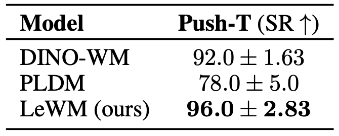
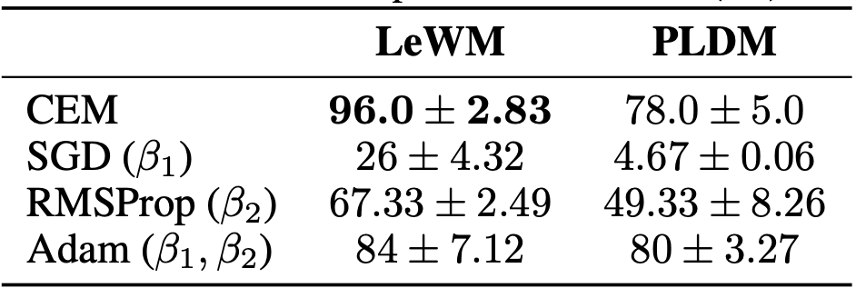
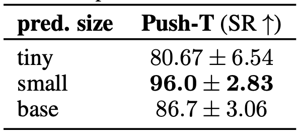
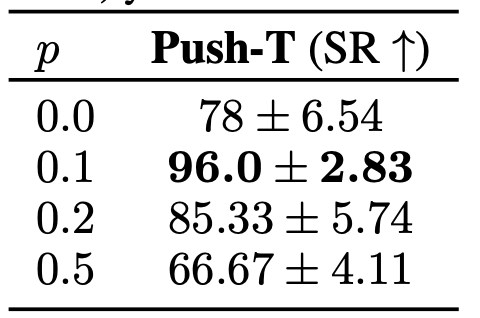
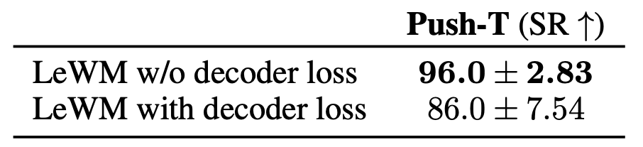
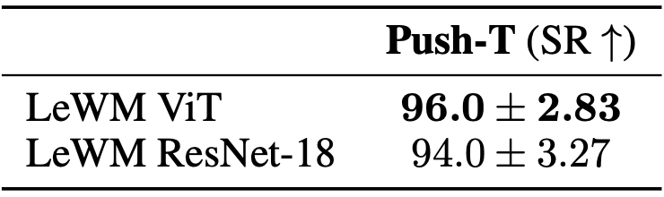
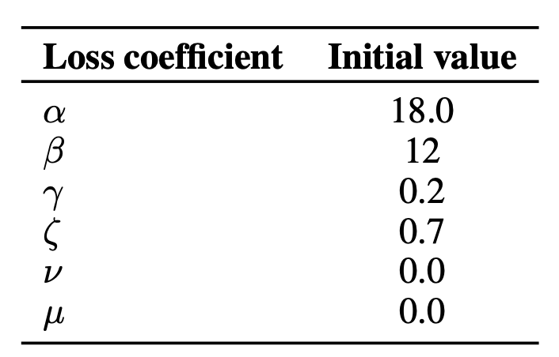

# LeWorldModel (LeWM) — Nội dung slide (trích xuất đầy đủ)

> File này được **trích xuất tự động** từ [`index.html`](index.html) — giữ nguyên văn toàn bộ chữ trên slide, dùng để đối chiếu với bài báo gốc (`../docs/LeWorldModel.pdf`).

**Mục lục**

1. [Title](#1-title)
2. [Glossary — thuật ngữ cần biết trước](#2-glossary--thuật-ngữ-cần-biết-trước)
3. [TL;DR — 5 điểm cần nhớ](#3-tldr--5-điểm-cần-nhớ)
4. [Bài toán: paper giải cái gì?](#4-bài-toán-paper-giải-cái-gì)
5. [Input — model nhận vào cái gì](#5-input--model-nhận-vào-cái-gì)
6. [Output — model trả ra cái gì](#6-output--model-trả-ra-cái-gì)
7. [Cách xử lý (1): quy trình train 5 bước](#7-cách-xử-lý-1-quy-trình-train-5-bước)
8. [Cách xử lý (2): quy trình planning 6 bước](#8-cách-xử-lý-2-quy-trình-planning-6-bước)
9. [Nền tảng: World Model & JEPA](#9-nền-tảng-world-model--jepa)
10. [Bản đồ các latent world model](#10-bản-đồ-các-latent-world-model)
11. [Method: pipeline training](#11-method-pipeline-training)
12. [Training objective: chỉ 2 term](#12-training-objective-chỉ-2-term)
13. [SIGReg hoạt động thế nào](#13-sigreg-hoạt-động-thế-nào)
14. [Kiến trúc & chi tiết implementation](#14-kiến-trúc--chi-tiết-implementation)
15. [Latent planning: dùng WM để hành động](#15-latent-planning-dùng-wm-để-hành-động)
16. [Môi trường thí nghiệm](#16-môi-trường-thí-nghiệm)
17. [Kết quả planning](#17-kết-quả-planning)
18. [Chi phí: nhanh hơn 48×](#18-chi-phí-nhanh-hơn-48)
19. [Model tưởng tượng ra gì?](#19-model-tưởng-tượng-ra-gì)
20. [Latent có hiểu vật lý không? (probing)](#20-latent-có-hiểu-vật-lý-không-probing)
21. [Hai hiện tượng emergent](#21-hai-hiện-tượng-emergent)
22. [Violation-of-Expectation: model có biết ngạc nhiên?](#22-violation-of-expectation-model-có-biết-ngạc-nhiên)
23. [Bằng chứng về tính ổn định](#23-bằng-chứng-về-tính-ổn-định)
24. [Ablations: cái gì quan trọng, cái gì không](#24-ablations-cái-gì-quan-trọng-cái-gì-không)
25. [Bảng số liệu gốc (ablations)](#25-bảng-số-liệu-gốc-ablations)
26. [Limitations & hướng phát triển](#26-limitations--hướng-phát-triển)
27. [Phụ lục A — Reference nên đọc trước](#27-phụ-lục-a--reference-nên-đọc-trước)
28. [Phụ lục B — Reference mở rộng](#28-phụ-lục-b--reference-mở-rộng)
29. [Sơ đồ tổng — nhớ cả paper trong 1 hình](#29-sơ-đồ-tổng--nhớ-cả-paper-trong-1-hình)

---

## 1. Title

`Preprint · arXiv:2603.19312v3 · Mila / NYU / Samsung SAIL / Brown`

### LeWorldModel (LeWM) —  Stable End-to-End Joint-Embedding Predictive Architecture from Pixels

Lucas Maes*, Quentin Le Lidec*, Damien Scieur, **Yann LeCun**, Randall Balestriero

`JEPA` · `World Model` · `SIGReg` · `End-to-end from pixels` · `Latent planning / MPC` · `Reward-free`

**[Một câu tóm tắt]**

JEPA đầu tiên train **ổn định, end-to-end từ pixel thô** chỉ với **2 loss** và **1 hyperparameter** — 15M params, 1 GPU, plan nhanh hơn foundation-model WM tới 48×.

> **Cách dùng deck này:** ← → đổi slide · **↑ ↓** cuộn slide dài · **O** xem overview · click vào hình để zoom.
>  **Slide 2** là **glossary** — quay lại bất cứ lúc nào gặp từ lạ. **Slide 4–8** phát biểu **bài toán, input, output và quy trình xử lý** — đọc trước nếu mới tiếp cận paper. Hai slide cuối là **Phụ lục reference**. Bản diễn giải đầy đủ thành câu nằm ở content.md.

*<sub>LeWorldModel — slide học tóm gọn</sub>*

---

## 2. Glossary — thuật ngữ cần biết trước

`Chuẩn bị — đọc trước khi vào paper`

### Glossary — thuật ngữ giữ nguyên tiếng Anh

Các thuật ngữ dưới đây xuất hiện xuyên suốt deck. Không cần thuộc ngay — quay lại slide này (phím **O** → ô số 2) bất cứ lúc nào gặp từ lạ.

**JEPA** (Joint-Embedding Predictive Architecture) — kiến trúc dự đoán **embedding** tương lai thay vì pixel tương lai.

**Representation collapse** — encoder map mọi input về (gần) cùng một vector; loss thấp nhưng representation vô dụng.

**SIGReg** (Sketched-Isotropic-Gaussian Regularizer) — regularizer ép phân phối embedding về 𝒩(0, I); "sketched" = chỉ kiểm tra qua các **random projection**.

**Isotropic Gaussian** — Gaussian có covariance = I: "tròn đều" mọi hướng, variance mỗi chiều = 1.

**Cramér–Wold theorem** — khớp **mọi marginal 1-D** ⟺ khớp phân phối joint. Nền tảng lý thuyết của SIGReg.

**Epps–Pulley test** — normality test 1-D dựa trên **empirical characteristic function** (ECF).

**VICReg** — Variance-Invariance-Covariance Regularization: chống collapse bằng cách chỉnh variance & covariance (moment bậc 2).

**EMA / stop-gradient (SG)** — heuristic phổ biến chống collapse; vấn đề: **không** tương ứng minimize một objective xác định.

**MPC** (Model Predictive Control) — plan một đoạn, thực thi vài action đầu, rồi **replan** từ observation mới.

**CEM** (Cross-Entropy Method) — optimizer **zero-order**: sample nhiều plan → giữ **top-K elites** → update μ, Σ của phân phối sampling → lặp.

**Teacher forcing** — khi train, luôn feed **ground-truth** z_t (không feed dự đoán của chính model).

**Open-loop rollout** — sinh tương lai **chỉ từ action**, không xem lại observation thật ⇒ test dynamics thật sự.

**AdaLN** (Adaptive LayerNorm) — nhét điều kiện (ở đây là action) vào network qua scale/shift của LayerNorm; init zero để ảnh hưởng tăng dần.

**Probing** — đóng băng representation, train model nhỏ đoán một đại lượng ⇒ đo xem thông tin có nằm trong representation không.

**Violation-of-Expectation (VoE)** — paradigm từ tâm lý phát triển: đo **surprise** trước sự kiện phi vật lý.

**Slow features** — thành phần biến đổi **chậm** trong scene; JEPA có xu hướng học chúng trước.

**Reward-free / offline** — chỉ có (observation, action), **không** reward, **không** được tương tác môi trường.

**Intrinsic dimensionality** — số chiều **thật sự** cần để mô tả dữ liệu, thường nhỏ hơn nhiều số chiều danh nghĩa. Two-Room có intrinsic dim rất thấp, và đó là lý do SIGReg gặp khó ở đó.

**Goal-conditioned** — ra lệnh cho agent bằng cách đưa **trạng thái đích** (ở đây là một tấm ảnh), thay vì bằng reward hay lệnh viết ra.

*<sub>Chuẩn bị · Glossary · slide này scroll được</sub>*

---

## 3. TL;DR — 5 điểm cần nhớ

`Tổng quan`

### TL;DR — 5 điểm cần nhớ

- **2** — loss terms: prediction + SIGReg (PLDM cần 7)

- **1** — hyperparameter thật sự cần tune: **λ** (PLDM: 6 → grid search O(n⁶))

- **15M** — params · train vài giờ trên 1 GPU

- **48×** — planning nhanh hơn DINO-WM (0.98s vs 47s)

**[Vấn đề paper giải quyết]**

JEPA học world model trong latent space rất hay, nhưng **rất dễ collapse** (encoder map mọi ảnh về cùng 1 vector để "gian lận" loss). Các cách chống collapse hiện tại đều **chắp vá**: EMA + stop-gradient, loss 7 số hạng, hoặc **đóng băng encoder pretrained**.

**[Ý tưởng cốt lõi]**

Thay mọi heuristic bằng **một regularizer có bảo đảm lý thuyết**: ép phân phối embedding về **isotropic Gaussian** (SIGReg). Gaussian ⇒ variance mọi chiều > 0 ⇒ **không thể collapse**.

**[Kết quả chính]**

- Thắng PLDM (end-to-end baseline) trên task khó: **+18%** success rate ở Push-T.
- Ngang / hơn DINO-WM dù **chỉ dùng pixel**, model nhỏ hơn nhiều.
- Latent space **encode được đại lượng vật lý** (probing) dù không hề train reconstruction.
- Biết "**ngạc nhiên**" khi vật thể teleport (violation-of-expectation).

> **Góc nhìn để nhớ:** LeWM = DINO-WM (đơn giản, chỉ 1 prediction loss) + PLDM (end-to-end từ pixel) − mọi heuristic, nhờ thay VICReg-family bằng SIGReg từ **LeJEPA**.

*<sub>TL;DR</sub>*

---

## 4. Bài toán: paper giải cái gì?

`Bài toán`

### Paper này giải bài toán gì?

**[Mục tiêu xa của lĩnh vực]**

Xây agent học được nhiều kỹ năng, nhiều môi trường bằng **một cách học duy nhất**, và học **thẳng từ camera** — không cần người thiết kế sẵn "trạng thái" cho từng bài toán. Camera rẻ và có ở khắp nơi nên hướng này mới scale được.

**[Công cụ: world model]**

Model học **dự đoán hệ quả của hành động**. Có nó rồi thì agent thử hàng trăm phương án **trong tưởng tượng** rồi mới chọn cái tốt nhất để làm thật.

Đặc biệt quý ở **offline setting**: chỉ có dataset cố định, **không được** tương tác thêm với môi trường.

**[Nhưng JEPA rất khó train]**

JEPA dự đoán trong latent thay vì pixel — hay về ý tưởng nhưng **cực dễ collapse**. Mọi cách chống collapse hiện có đều **chắp vá** và phải trả giá: EMA+stop-grad (không có objective rõ ràng), encoder đóng băng (mất end-to-end), hoặc loss 7 số hạng (bất ổn).

**[Phát biểu bài toán — một câu]**

Làm sao train được một **JEPA world model**, học **end-to-end trực tiếp từ pixel thô**, một cách **ổn định**, mà **không cần bất kỳ heuristic chống collapse nào**, và có **bảo đảm lý thuyết** rằng nó không collapse?

> **Câu trả lời của paper:** một objective chỉ có **2 số hạng** và **1 hyperparameter**, trong đó số hạng thứ hai (SIGReg) ép phân phối embedding thành **Gaussian đẳng hướng**. Gaussian đẳng hướng ⇒ mọi chiều có variance = 1 ⇒ collapse (variance = 0) là **bất khả thi về mặt toán học**, chứ không phải "hy vọng nó không xảy ra".

*<sub>Bài toán · Sec. 1</sub>*

---

## 5. Input — model nhận vào cái gì

`Bài toán — vào / ra`

### Input: model nhận vào cái gì?

**[Lúc TRAIN — quỹ đạo offline, không nhãn]**

| Thành phần | Mô tả |
|---|---|
| o_1:T | Các frame **pixel thô**, RGB **224×224**. Không qua bước trích đặc trưng thủ công nào. |
| a_1:T | Hành động **liên tục** tương ứng từng bước. |

**[Và những thứ model KHÔNG được cho]**

`✘ reward` · `✘ nhãn nhiệm vụ` · `✘ proprioception` · `✘ trạng thái đặc quyền`

Quỹ đạo **không cần tối ưu** — pseudo-expert hay exploratory đều được, **miễn là phủ đủ dynamics**. Đây chính là chỗ LeWM sẽ yếu đi khi data quá nghèo (ca Two-Room).

**[Tensor thực tế khi chạy code]**

```
obs     : (B, T, C, H, W) = (128, 4, 3, 224, 224)
actions : (B, T, A)
```

Mỗi mẫu train chỉ là một **sub-trajectory 4 frame** cắt ra từ quỹ đạo dài ~200 bước, không phải cả quỹ đạo.

**[Lúc DÙNG (planning) — ra lệnh bằng ảnh]**

| Thành phần | Mô tả |
|---|---|
| o_1 | Ảnh tình trạng **hiện tại** của môi trường. |
| o_g | **Một tấm ảnh** mô tả trạng thái mong muốn. |

Người dùng **không viết lệnh, không đặt reward** — chỉ đưa **ảnh của cái đích**. Cách ra lệnh này gọi là **goal-conditioned**.

**[Chi tiết nhỏ, ảnh hưởng lớn: frame-skip = 5]**

5 hành động liên tiếp được gom thành **1 "action block"**, nên mỗi bước model thấy = 5 bước thật của môi trường.

- Cho phép dự đoán **xa hơn về thời gian** với cùng chi phí compute.
- Hai frame liên tiếp **khác nhau đủ nhiều** — nếu gần giống hệt thì bài toán dự đoán thành tầm thường.

Vì thế T = 4 frame ⟺ **4 block × 5 hành động**.

*<sub>Bài toán · Sec. 3.1 + App. D, E</sub>*

---

## 6. Output — model trả ra cái gì

`Bài toán — vào / ra`

### Output: model trả ra cái gì?

**[Kết quả của quá trình TRAIN — hai mạng, học cùng lúc]**

```
Encoder   : z_t = enc_θ(o_t) // ảnh 224×224 → vector 192-D

          Predictor : ẑ_t+1 = pred_φ(z_t, a_t) // (vector, action) → vector kế tiếp
```

- **~5M** — encoder (ViT-Tiny)

- **~10M** — predictor (ViT-S)

Tổng **~15M tham số** — train vài giờ trên **1 GPU**. Đáng để so sánh: DINO-WM dùng DINOv2, pretrain trên **~124 triệu ảnh**.

**[Kết quả của quá trình PLANNING]**

```
a*_1:H   // H = 5 block ≈ 25 bước môi trường
```

Một **chuỗi hành động** được cho là đưa môi trường từ o_1 tới gần o_g nhất.

**Không có policy network nào được train.** Hành động được tìm bằng cách **tối ưu trực tiếp tại thời điểm chạy** — mỗi lần cần hành động là một lần giải bài toán tối ưu.

**[Decoder: có, nhưng không phải output của phương pháp]**

Paper có train một decoder latent → ảnh, nhưng nó được train **sau khi world model đã xong**, **không** đóng góp gradient nào, và chỉ để **con người nhìn xem model tưởng tượng ra gì**. Nó là công cụ chẩn đoán.

> **Khác biệt căn bản với nhánh Dreamer:** Dreamer train hẳn một policy rồi **vứt world model đi** lúc chạy. LeWM thì ngược lại — **không có policy**, world model chính là thứ được dùng lúc chạy.

*<sub>Bài toán · Sec. 3.1–3.2</sub>*

---

## 7. Cách xử lý (1): quy trình train 5 bước

`Bài toán — cách xử lý`

### Quy trình train: với mỗi batch, model làm đúng 5 việc

**[Bước 1 — Encode]**

Mọi frame trong batch đi qua encoder thành vector: z_t = enc_θ(o_t). Đầu ra là tensor (B, T, D) với **D = 192**.

**[Bước 2 — Dự đoán]**

Predictor nhận z_t cùng hành động a_t và đoán vector frame kế tiếp. Nó chạy **tự hồi quy** trên lịch sử N frame với **causal mask** — khi đoán bước t+1 chỉ được nhìn các bước ≤ t, không nhìn trộm tương lai.

**[Bước 3 — Tính prediction loss]**

So vector dự đoán với vector thật: 𝓛_pred = ‖ẑ_t+1 − z_t+1‖²₂. Ở đây z_t+1 là embedding **thật** do chính encoder tạo ra từ frame thật — cách train này gọi là **teacher forcing**.

**[Bước 4 — Tính loss chống collapse (SIGReg)]**

Lấy toàn bộ embedding trong batch, kiểm tra phân phối của chúng có giống **𝒩(0, I)** không, và phạt theo mức độ lệch. Cơ chế chi tiết: xem slide "SIGReg hoạt động thế nào".

**[Bước 5 — Cộng lại và lan truyền ngược]**

𝓛_LeWM = 𝓛_pred + λ · SIGReg(Z), với **λ = 0.1**. Gradient chảy ngược qua **toàn bộ** model, cập nhật encoder và predictor **cùng lúc**.

> **Đây chính là nghĩa của chữ "end-to-end":** không stop-gradient, không EMA target encoder, không encoder đóng băng, không tín hiệu phụ trợ. Gradient chảy qua mọi nhánh của loss.

*<sub>Bài toán · Sec. 3.1 · Alg. 3</sub>*

---

## 8. Cách xử lý (2): quy trình planning 6 bước

`Bài toán — cách xử lý`

### Quy trình planning: train xong rồi thì sai khiến agent thế nào?

**[Bước 1 — Encode hai đầu]**

Encode ảnh hiện tại và ảnh đích thành hai vector: ẑ_1 = enc_θ(o_1) và z_g = enc_θ(o_g).

**[Bước 2 — Khởi tạo kế hoạch]**

Sinh ngẫu nhiên một chuỗi hành động ứng viên độ dài H.

**[Bước 3 — Chạy trong tưởng tượng]**

Từ ẑ_1 và chuỗi hành động, predictor lần lượt tính ẑ_2, …, ẑ_H. Toàn bộ diễn ra trong latent space, **không dựng lại ảnh nào** — đây là nguồn gốc của tốc độ.

**[Bước 4 — Chấm điểm]**

C(ẑ_H) = ‖ẑ_H − z_g‖²₂. Chỉ so **trạng thái cuối** với đích, không cần reward từng bước ⇒ **reward-free**.

**[Bước 5 — Solver sửa kế hoạch, lặp lại]**

Solver cập nhật chuỗi hành động cho cost nhỏ đi rồi quay lại bước 3. **Trọng số world model bị đóng băng** — thứ duy nhất được tối ưu là chuỗi hành động.

**[Bước 6 — Thực thi rồi lập kế hoạch lại]**

Chạy kế hoạch ra môi trường thật, quan sát ảnh mới, rồi **lập kế hoạch lại từ đầu** (ý của MPC). Chi tiết solver: xem slide "Latent planning".

> **Nhìn tổng thể:** world model đóng vai **trình mô phỏng nhanh** để giải một bài toán điều khiển tối ưu hữu hạn horizon. Nó không "biết" nhiệm vụ là gì — nhiệm vụ nằm hoàn toàn trong tấm ảnh đích.

*<sub>Bài toán · Sec. 3.2 + App. B, D</sub>*

---

## 9. Nền tảng: World Model & JEPA

`Nền tảng`

### World Model là gì? JEPA khác gì?

**World Model (WM)**

Model học **dự đoán hệ quả của hành động** trong môi trường. Có WM rồi thì agent có thể "tưởng tượng" (plan trong imagination space) mà không cần thử thật.

Rất quý trong **offline setting**: chỉ có dataset cố định, không được tương tác môi trường.

**Generative WM — dự đoán pixel**

IRIS, DIAMOND, DreamerV4, Genie… sinh ra **frame tương lai**. Mạnh nhưng phải model **mọi chi tiết** ảnh (mây, texture, noise) — đắt và phần lớn chi tiết vô ích cho việc điều khiển.

Nhiều method cần cả **reward** trong dataset.

**JEPA — dự đoán trong latent**

Thay vì đoán pixel, encode ảnh thành vector nhỏ z rồi **đoán z tương lai**. Chỉ giữ thứ cần cho dự đoán, bỏ chi tiết vô nghĩa.

**Reward-free, reconstruction-free, task-agnostic.**

**[Điểm chết của JEPA: representation collapse]**

Loss "đoán z tiếp theo" có một **nghiệm gian lận hoàn hảo**: encoder cho mọi ảnh ra **cùng một vector hằng số** → predictor đoán trúng 100%, loss = 0, nhưng representation **vô dụng**.

```
enc(o) = c  ∀o  ⟹  ‖ẑ_t+1 − z_t+1‖² = 0 // loss thấp nhất, model rỗng
```

Chống collapse là **bài toán trung tâm** của cả dòng JEPA.

**[Các cách chống collapse trước đây (và giá phải trả)]**

- **EMA + stop-gradient** (I-JEPA, V-JEPA): hoạt động được nhưng **không tương ứng minimize một objective rõ ràng** ⇒ khó phân tích.
- **Frozen pretrained encoder** (DINO-WM): hết collapse, nhưng **không còn end-to-end** và bị chặn bởi kiến thức pretrain.
- **VICReg + nhiều term phụ** (PLDM): end-to-end thật, nhưng **7 term / 6 hệ số**, train bất ổn, khó scale.
- **Tín hiệu phụ trợ**: proprioception, action decoder… ⇒ thêm giả định về dữ liệu.

*<sub>Nền tảng · Sec. 1–2</sub>*

---

## 10. Bản đồ các latent world model

`Bối cảnh`

### LeWM đứng ở đâu trên bản đồ?


*Figure 2 — Đặc tính các hướng làm latent world model. LeWM lấy điểm mạnh của cả 3 nhóm.*

**[PLDM (end-to-end)]**

✔ Học encoder + predictor từ pixel  
✘ 6 hyperparameters  
✘ Anti-collapse **under-specified**

**[DINO-WM (foundation)]**

✔ Không collapse (encoder đóng băng)  
✘ Không end-to-end  
✘ Bị giới hạn bởi kiến thức pretrain

**[Dreamer / TD-MPC]**

✘ Task-specific  
✘ Cần **reward** hoặc state đặc quyền  
✘ Phải reconstruct ảnh / reward

**[LeWM]**

✔ End-to-end, pixel-based  
✔ Task-agnostic, reward-free, reconstruction-free  
✔ **1 hyperparameter** + anti-collapse **có chứng minh**

*<sub>Bối cảnh · Fig. 2</sub>*

---

## 11. Method: pipeline training

`Method`

### Pipeline training: encoder + predictor, học chung một lần


*Figure 1 — Frame o_t → encoder → z_t; predictor(z_t, a_t) → ẑ_t+1; MSE với z_t+1 thật. SIGReg áp lên embedding để chặn collapse.*

**[Hai thành phần]**

```
Encoder:   z_t = enc_θ(o_t)

          Predictor: ẑ_t+1 = pred_φ(z_t, a_t)
```

Cả hai được optimize **đồng thời, end-to-end**. Gradient chảy qua **mọi** nhánh của loss.

**[Điểm quan trọng: KHÔNG dùng gì cả]**

`✘ stop-gradient` · `✘ EMA target encoder` · `✘ pretrained encoder` · `✘ reconstruction loss` · `✘ reward` · `✘ proprioception`

Dataset: chỉ trajectory **(o_1:T, a_1:T)** offline, không cần optimal — miễn là **phủ đủ dynamics** của môi trường.

*<sub>Method · Sec. 3.1 · Fig. 1</sub>*

---

## 12. Training objective: chỉ 2 term

`Method`

### Training objective: chỉ 2 term

```
𝓛_LeWM  =  𝓛_pred
       +  λ · SIGReg(Z)
      λ = 0.1 (default) — hyperparameter **duy nhất** cần tune
```

**1. Prediction loss — dạy model về dynamics**

```
𝓛_pred = ‖ẑ_t+1 − z_t+1‖²₂   // teacher forcing
```

- Ép predictor học **quy luật vận động** của môi trường.
- Đồng thời ép encoder tạo ra representation **dễ dự đoán** — đây là chỗ hay: encoder tự học bỏ chi tiết ngẫu nhiên vô nghĩa.
- Nhưng nếu **chỉ có term này** → collapse.

**2. SIGReg — chặn collapse**

Ép phân phối của embedding **khớp isotropic Gaussian 𝒩(0, I)**.

```
SIGReg(Z) = (1/M) Σ_m T(h^(m)),  h^(m) = Z u^(m)
```

- Gaussian ⇒ mọi chiều có **variance = 1** ⇒ constant-collapse là **bất khả thi**, có bảo đảm lý thuyết (từ LeJEPA).
- Áp **theo từng time-step** (step-wise), không ràng buộc chiều thời gian.

> **Vì sao "1 hyperparameter" là chuyện lớn:** tune 1 tham số dùng được **bisection search — O(log n)**. PLDM có 6 hệ số ⇒ grid search **O(n⁶)**, và hệ số tốt còn phụ thuộc từng environment (khó transfer).

*<sub>Method · Sec. 3.1, Eq. 1–3</sub>*

---

## 13. SIGReg hoạt động thế nào

`Method — điểm kỹ thuật quan trọng nhất`

### SIGReg: ép Gaussian trong không gian nhiều chiều bằng cách nào?

**Khó khăn:** test normality trực tiếp trong **d chiều cao** là không khả thi — hầu hết normality test kinh điển chỉ dành cho **dữ liệu 1 chiều** và không scale theo số chiều.

**[Bước 1 — Random projection]**

Lấy **M hướng ngẫu nhiên** u^(m) đơn vị trên hypersphere, chiếu embedding xuống:

```
h^(m) = Z u^(m)  ∈ ℝ^N
// mỗi h là 1 chuỗi số 1-D
```

Default **M = 1024**. Ablation cho thấy M gần như **không ảnh hưởng** kết quả.

**[Bước 2 — Test normality 1-D]**

Trên từng chiều chiếu, tối thiểu hoá **Epps–Pulley statistic** — so **empirical characteristic function (ECF)** của dữ liệu với ECF của 𝒩(0,1):

```
T = ∫ w(t)·|φ_N(t;h) − φ₀(t)|² dt

          φ_N(t;h) = (1/N) Σ_n e^i·t·h_n // ECF của mẫu

          w(t) = e^−t²/(2λ²) // hàm trọng số

          // tích phân xấp xỉ bằng quadrature (hình thang),
// T nodes chia đều trong [0.2, 4]
```

Vì target là isotropic Gaussian, mọi marginal 1-D đều đúng bằng **𝒩(0,1)** — nên chỉ cần **một** target duy nhất cho mọi hướng chiếu.

**[Bước 3 — Vì sao đủ? Cramér–Wold]**

Định lý Cramér–Wold: nếu **tất cả marginal 1-D** khớp nhau thì **phân phối joint** khớp nhau.

```
SIGReg(Z) → 0 ⟺ P_Z → 𝒩(0, I)
```

Đây là chỗ khác biệt căn bản với VICReg: VICReg chỉ chỉnh **variance + covariance** (moment bậc 2) — **under-specified**, còn nhiều phân phối xấu vẫn thoả. SIGReg khoá **toàn bộ** phân phối.

> **Trực giác dân dã:** muốn kiểm tra một khối mây điểm 192-chiều có "tròn đều như Gaussian" không thì rất khó. Nên ta **chiếu bóng nó lên 1024 hướng ngẫu nhiên**, kiểm tra từng cái bóng 1-D có hình chuông không. Mọi bóng đều đúng ⇒ khối mây đúng.

> **⚠ Cảnh báo trùng ký hiệu:** chữ λ trong hàm trọng số w(t) ở Bước 2 là **băng thông của phép kiểm định** — **khác hoàn toàn** λ = 0.1 là trọng số regularizer trong loss tổng. Paper dùng trùng ký hiệu ở hai chỗ.

*<sub>Method · Sec. 3.1 + App. A</sub>*

---

## 14. Kiến trúc & chi tiết implementation

`Method`

### Kiến trúc & chi tiết implementation

**[Encoder — ViT-Tiny (~5M)]**

- ViT-T, **patch 14**, 12 layers, 3 heads, hidden 192; input **224×224**.
- Embedding lấy từ **[CLS] token** layer cuối, rồi qua **projection 1-layer MLP + BatchNorm**.
- **Vì sao cần projection?** Layer cuối ViT có **LayerNorm** — nó chuẩn hoá lại vector và làm **SIGReg không optimize được**. Chi tiết nhỏ nhưng cực quan trọng.
- Thay bằng **ResNet-18** vẫn chạy tốt (94% vs 96%) ⇒ method **agnostic với backbone**.

**[Predictor — ViT-S transformer (~10M)]**

- 6 layers, 16 heads, **dropout 0.1** (dropout rất quan trọng: 0.0 → 78%, 0.1 → 96%).
- Action đưa vào qua **AdaLN** mỗi layer, khởi tạo **zero** để action conditioning ảnh hưởng **dần dần** → train ổn định hơn.
- **Autoregressive + causal mask** trên history N frame (N=3 cho PushT/Cube, N=1 cho TwoRoom).
- Predictor **cũng có một projector ở sau**, cài đặt y hệt projector của encoder.

**[Pseudo-code (Alg. 3) — thật sự chỉ có thế]**

```
def LeWorldModel(obs, actions, lambd=0.1):
    # obs:     (B, T, C, H, W) pixel thô
    # actions: (B, T, A)
    emb      = encoder(obs)             # (B,T,D)
    next_emb = predictor(emb, actions)  # (B,T,D)

    # next-embedding prediction loss
    pred_loss = F.mse_loss(emb[:, 1:] - next_emb[:, :-1])

    # step-wise SIGReg (anti-collapse)
    sigreg_loss = mean(SIGReg(emb.transpose(0, 1)))

    return pred_loss + lambd * sigreg_loss
```

**[Data pipeline]**

frame-skip **5** · batch **128** · sub-trajectory **4 frame** · `4 action block × 5` · `224×224` · train **10 epochs**

Frame-skip gom 5 action liên tiếp thành 1 "action block" ⇒ dự đoán xa hơn với cùng chi phí compute.

> **Decoder chỉ để visualize:** transformer decoder nhẹ, cross-attention từ [CLS] (192-dim) ra 196 patch token → ảnh 224×224. Train **sau** (a posteriori), **không** tham gia training world model.

*<sub>Method · Sec. 3.1 + App. D</sub>*

---

## 15. Latent planning: dùng WM để hành động

`Method`

### Latent planning: có world model rồi thì điều khiển thế nào?


*Figure 4 — Encode o₁ và goal o_g; predictor rollout tới horizon H; cost trong latent space dẫn solver update action sequence; lặp tới khi hội tụ.*

**[Bài toán optimal control hữu hạn horizon]**

```
C(ẑ_H) = ‖ẑ_H − z_g‖²₂ ,  z_g = enc_θ(o_g)

          a*_1:H = argmin_a_1:H C(ẑ_H) // weight của WM đóng băng
```

Chỉ so **state cuối** với goal — **không cần reward**, không cần train policy.

**Nhược điểm của CEM, do chính paper nêu:** trong bài toán **không lồi** thì **không có bảo đảm** hội tụ về nghiệm tối ưu toàn cục, và nó chịu **lời nguyền số chiều** — không gian hành động càng lớn thì CEM càng đuối.

**[Solver: CEM + MPC]**

- **CEM** (zero-order sampling): sample **300** action sequence từ Gaussian (khởi tạo μ₀ = 0, Σ₀ = I, sampling variance = 1) → chấm điểm bằng WM → giữ **top 30 elites** → update μ, Σ → lặp **30** vòng (PushT) / 10 vòng (khác). Kế hoạch cuối là μ của vòng cuối.
- **Horizon H = 5** (≈ 25 env step do frame-skip 5). H lớn thì nhìn xa hơn nhưng tốn compute hơn **và** tích luỹ nhiều lỗi autoregressive hơn.
- **MPC receding-horizon**: chạy plan rồi **replan** từ observation mới ⇒ mỗi lần lập kế hoạch đều xuất phát từ một quan sát **thật**, chưa nhiễm lỗi tích luỹ.

> **⚠ Paper tự mâu thuẫn:** Sec. 3.2 viết chỉ **K hành động đầu** được thực thi trước khi replan; App. D viết **toàn bộ** chuỗi được thực thi rồi mới replan (K = H = 5). Khi implement nên theo App. D vì đó là phần mô tả cấu hình thí nghiệm.

*<sub>Method · Sec. 3.2 + App. B, D</sub>*

---

## 16. Môi trường thí nghiệm

`Experiments`

### 4 môi trường: 2D → 3D, navigation → manipulation


*Figure 5 — Push-T · OGBench-Cube · Two-Room · Reacher. Tất cả đều **continuous action space**.*

**[Push-T (2D manip.)]**

Đẩy khối chữ T về đúng cấu hình đích. Benchmark robotics phổ biến. 20k expert episode, dài ~196 step.

**[OGBench-Cube (3D manip.)]**

Tay robot gắp cube và đặt vào vị trí đích. Visual phức tạp nhất. 10k episode × 200 step.

**[Two-Room (2D nav.)]**

Agent (điểm đỏ) đi từ phòng này sang phòng kia qua 1 cửa. **Đơn giản nhất**. 10k episode ~92 step. Data sinh bằng **heuristic policy có nhiễu** (đi tới cửa trước, sang phòng rồi mới tới đích) ⇒ **dataset kém đa dạng**, và đây chính là lý do LeWM thua ở env này.

**[Reacher (DM Control)]**

Tay 2 khớp trên mặt phẳng 2D. Định nghĩa thành công **khắt khe hơn ta tưởng**: các **khớp phải khớp chính xác cấu hình đích**, không chỉ là chạm tới vị trí. Data từ policy SAC. 10k episode × 200 step.

> **Setup đánh giá:** goal lấy từ chính trajectory trong dataset, **25 step** về sau ⇒ luôn **khả thi**. Budget: **50 step**. Hyperparameter **giữ nguyên cho mọi environment** (không tune riêng) — đây là điểm mạnh cần nhấn.

**[Baselines]**

`DINO-WM` · `DINO-WM+prop` · `PLDM` · `GCBC` · `GCIQL` · `GCIVL` · `Random`

DINO-WM bị **bỏ proprioception** cho công bằng (bản +prop báo cáo riêng).

**Cần nói rõ khi trình bày:** GCBC / GCIQL / GCIVL đều mã hoá observation và goal bằng **DINOv2 patch embeddings** — tức chúng **cũng hưởng lợi từ pretrain khổng lồ**, trong khi LeWM học encoder từ con số không.

*<sub>Experiments · Sec. 4.1 + App. E, F.1</sub>*

---

## 17. Kết quả planning

`Results`

### Kết quả planning: thắng ở task khó, thua ở task quá dễ


*Figure 6 — Success rate (%) trên Two-Room · Reacher · Push-T · OGBench-Cube.*

**[Đọc số nhanh]**

| Env | LeWM | PLDM | DINO-WM | Nhận xét |
|---|---|---|---|---|
| Push-T | 96 | 78 | 74 (+prop 92) | Thắng đậm, **hơn cả DINO-WM+prop** |
| Reacher | 86 | 78 | 79 | Thắng |
| OGB-Cube | 74 | 65 | 86 | Thắng PLDM, thua DINO-WM |
| Two-Room | 87 | 97 | 100 | Thua — xem giải thích → |

**[Điểm hay nhất]**

Push-T: LeWM **chỉ dùng pixel** mà vượt DINO-WM có thêm **proprioception** ⇒ encoder tự học ra được đại lượng task-relevant mà không cần cho sẵn.

**[Điểm yếu — nhớ để nói ra]**

Two-Room (đơn giản nhất) LeWM lại kém. Giải thích của tác giả: dataset **ít đa dạng, intrinsic dimensionality thấp**, nên bắt embedding khớp Gaussian trong không gian **chiều cao** là ép quá đáng ⇒ latent kém structure. **Đây là limitation của SIGReg**.

*<sub>Results · Sec. 4.2 · Fig. 6</sub>*

---

## 18. Chi phí: nhanh hơn 48×

`Results`

### Chi phí: planning dưới 1 giây, nhanh hơn 48×


*Figure 3 — Trái: thời gian plan (trung bình 50 lần). Giữa/phải: success rate khi **khoá cùng FLOPs**.*

- **0.98s vs 47s** — Full planning: LeWM vs DINO-WM ⇒ **~48×**. Tiến gần **real-time control**.

- **~200×** — ít token hơn khi encode observation (1 vector [CLS] vs full patch grid của DINOv2) — đây là lý do gốc của tốc độ.

- **90 vs 13  
74 vs 48** — Success rate ở **cùng FLOPs**: Push-T (90 vs 13) và OGB-Cube (74 vs 48).

> **Ý nghĩa:** so sánh "cùng FLOPs" mới là so sánh công bằng cho ứng dụng thực. Khi bị giới hạn compute, DINO-WM chỉ chạy được rất ít vòng CEM nên sụp (13%), còn LeWM vẫn plan đủ sâu ⇒ **latent nhỏ gọn là lợi thế hệ thống**, không chỉ là tiết kiệm bộ nhớ.

*<sub>Results · Sec. 4.2 · Fig. 3</sub>*

---

## 19. Model tưởng tượng ra gì?

`Phân tích`

### Model "tưởng tượng" ra gì? (decode latent rollout)


*Figure 7 — OGBench-Cube: 3 frame context → rollout **open-loop** theo action. Hàng trên = thật, hàng dưới = tưởng tượng (decode).*

**[Cách đọc]**

- Encode **3 ảnh context**, sau đó chỉ đưa **action** — model tự sinh latent tương lai, **không xem ảnh thật nữa** (open-loop).
- Ảnh được decode bằng decoder train **sau**, chỉ để xem — không dùng khi train.

**[Kết luận]**

Latent giữ được **cấu trúc scene toàn cục** và **chuyển động của cube**. Nhưng chi tiết mịn như **góc quay end-effector** bị mất dần ở horizon dài — khớp với probing: đại lượng **rotational** khó encode nhất (Tab. 4).


*Figure 9 — Thêm rollout. Trên PushT, quỹ đạo tưởng tượng **bám rất sát** thật (cả agent lẫn block).*

*<sub>Phân tích · Sec. 5.1 · Fig. 7, 9</sub>*

---

## 20. Latent có hiểu vật lý không? (probing)

`Phân tích — Physical understanding`

### Latent có encode đại lượng vật lý không? → Probing


*Table 1 — Push-T: probe **linear** và **MLP** đoán agent location / block location / block angle. Báo cáo **MSE ↓** và **Pearson r ↑**.*

**[Probing là gì (nói đơn giản)]**

Đóng băng encoder, train một **model nhỏ** (linear hoặc MLP) đoán đại lượng vật lý thật từ vector latent. Đoán được ⇒ thông tin đó **có nằm trong latent**.

**Linear probe**: thông tin có **truy cập tuyến tính** được không.  
 **MLP probe**: thông tin **có mặt** nhưng có thể bị **entangled**.

**[Kết quả]**

- LeWM **đều đặn thắng PLDM**, và **cạnh tranh với DINO-WM**.
- Rất đáng chú ý vì DINOv2 pretrain trên **~124M ảnh** (nhiều hơn 2 bậc độ lớn) — nên nó "biết sẵn" nhiều thuộc tính vật lý.
- Chỗ mọi method đều **kém**: **orientation / quaternion / yaw** (Tab. 4) ⇒ thông tin xoay rất khó nhét vào latent nhỏ.
- **Đừng nói quá:** ở dòng **Overall** của Tab. 4, DINO-WM vẫn dẫn về tương quan (r = **0.725** vs **0.477**), và ở MLP probe overall thì PLDM nhỉnh hơn LeWM chút ít. LeWM tốt nhất ở **nhóm vị trí**, không phải toàn diện.


*Table 3 — TwoRoom: LeWM ≈ PLDM, cả hai **hơn xa** DINO-WM ở linear probe ⇒ **latent không tệ**, nên gap ở planning đến từ **dynamics/solver**, không phải representation.*


*Table 4 — OGBench-Cube: LeWM tốt nhất ở **positional** (block pos, end-effector pos); DINO-WM vẫn hơn ở **velocity / yaw**.*


*Figure 13 — t-SNE latent PushT: **giữ được cấu trúc không gian** — quan hệ lân cận và vị trí tương đối được bảo toàn.*

*<sub>Phân tích · Sec. 5.1 · Tab. 1, 3, 4 · Fig. 13</sub>*

---

## 21. Hai hiện tượng emergent

`Phân tích`

### Hai hiện tượng emergent (không hề được train để có)


*Figure 10 — Decode latent (192-dim) qua các mốc training. **Không có reconstruction loss** nào khi train world model.*

**[1. Latent tự chứa đủ thông tin để dựng lại scene]**

Càng train, decoder dựng lại ảnh càng đúng — dù **reconstruction chưa bao giờ là mục tiêu**. Chứng tỏ latent **192 chiều** giữ đủ physical state.

Giai đoạn đầu, ảnh decode ra tương ứng **slow features** (thứ biến đổi chậm nhất trong scene) — hiện tượng đã được báo cáo ở JEPA trước đó.


*Figure 17 — Temporal straightening trên Push-T.*

**[2. Temporal latent path straightening]**

Đo **cosine similarity giữa các velocity vector liên tiếp** v_t = z_t+1 − z_t. Gần 1 ⇒ quỹ đạo latent gần **đường thẳng**. Ý tưởng gốc từ **neuroscience** (Hénaff et al.): não biểu diễn động lực phức tạp thành đường gần thẳng.

**Bất ngờ:** LeWM **thẳng hơn PLDM**, mặc dù PLDM có **hẳn một term** (𝓛_time-sim) để ép temporal smoothness, còn LeWM **không có gì cả**.

> **Giả thuyết của tác giả:** SIGReg chỉ áp **từng time-step**, **không** ràng buộc theo chiều thời gian ⇒ chiều thời gian được "tự do", encoder trôi về dạng **temporal collapse nhẹ** (đường thẳng). Không có hại — thậm chí **giúp** planning.

*<sub>Phân tích · Sec. 5.1 + App. H · Fig. 10, 17</sub>*

---

## 22. Violation-of-Expectation: model có biết ngạc nhiên?

`Phân tích — Physical understanding`

### Violation-of-Expectation: model có biết "ngạc nhiên"?


*Figure 8 — Surprise (MSE dự đoán) theo thời gian, 3 môi trường: TwoRoom · PushT · OGBench-Cube.*

**[Framework (từ developmental psychology)]**

Đo **surprise** = sai số giữa dự đoán và thực tế. Model "hiểu vật lý" thì phải **ngạc nhiên nhiều hơn** khi thấy chuyện **trái quy luật vật lý**.

- **Visual perturbation**: vật đổi **màu** đột ngột (lạ mắt nhưng **không** phạm luật vật lý).
- **Physical perturbation**: vật **teleport** tới vị trí ngẫu nhiên (phá vỡ **tính liên tục vật lý**).

**[Kết quả — và đây mới là chỗ tinh tế]**

LeWM nhảy surprise **rất mạnh khi teleport** (paired t-test, **p < 0.01** ở cả 3 env), nhưng phản ứng **yếu và không significant** với đổi màu.

⇒ Model **nhạy với vi phạm vật lý hơn vi phạm thị giác** — đúng như ta muốn ở một world model.

**Điểm mạnh nằm ở đâu, nói cho chuẩn:** không phải ở chỗ "biết ngạc nhiên" — cả 3 method đều biết, ở env đơn giản. Mà ở chỗ **ngạc nhiên có chọn lọc**: mạnh với cái sai về bản chất, nhẹ với cái chỉ khác bề ngoài.


*Figure 11 — Ví dụ trajectory: hàng 1 không nhiễu, hàng 2 đổi màu, hàng 3 teleport. Frame xảy ra nhiễu được **khoanh đỏ**.*


*Figure 12 — **PLDM**: ngạc nhiên mạnh với **cả hai** loại nhiễu ở TwoRoom/PushT (không phân biệt được physical vs visual); ở Cube thì tín hiệu yếu.*


*Figure 14 — **DINO-WM**: phát hiện được **cả hai** loại nhiễu ở TwoRoom/PushT — tức **cũng không phân biệt** được physical vs visual; ở OGBench-Cube thì **không** tăng surprise đáng kể với bất kỳ loại nhiễu nào.*

*<sub>Phân tích · Sec. 5.2 + App. F.3 · Fig. 8, 11, 12, 14</sub>*

---

## 23. Bằng chứng về tính ổn định

`Results`

### Bằng chứng "stable": 2 term êm ả vs 7 term nhiễu loạn


***Figure 18 — LeWM (2 term):** prediction loss giảm **đều và monotonic**; SIGReg tụt rất nhanh ở đầu rồi plateau ⇒ latent nhanh chóng đạt Gaussian.*


***Figure 19 — PLDM (7 term):** nhiều thành phần loss **nhiễu, non-monotonic**, phải cân bằng gradient của các regularizer đánh nhau.*



*Table 5 — Variance qua 3 seed (Push-T): LeWM **96.0 ± 2.83** · DINO-WM 92.0 ± 1.63 · PLDM **78.0 ± 5.0**.*

**[Chốt lại "stability" nghĩa là gì]**

Không chỉ là "loss đẹp": (1) loss curve **monotonic**, (2) **variance thấp** giữa các seed, (3) **robust** với architecture & hyperparameter, (4) tune được bằng **bisection O(log n)**.

> **PLDM để so sánh:** 𝓛 = 𝓛_pred + α𝓛_var + β𝓛_cov + γ𝓛_time-sim + ζ𝓛_time-var + ν𝓛_time-cov + μ𝓛_IDM — 6 hệ số phải tune, và paper này phải chạy grid search **256 config** chỉ trên Push-T để tìm bộ tốt (Tab. 2).

*<sub>Results · Sec. 4.3 + App. C.2, I</sub>*

---

## 24. Ablations: cái gì quan trọng, cái gì không

`Results`

### Ablations: cái gì thật sự quan trọng?


*Figure 15 — **Trái:** embedding dim (cần đủ lớn, ~184, rồi **saturate**). **Giữa:** số random projection M (**không quan trọng**). **Phải:** số integration knots (**không quan trọng**).*


*Figure 16 — λ: success rate **>80% với λ ∈ [0.01, 0.2]**, đỉnh quanh **λ = 0.09**; chỉ sụp ở **λ = 0.5** khi regularizer **đè bẹp** prediction loss.*

**[Predictor size (Tab. 6)]**

tiny 80.7 · **small 96.0** · base 86.7  
ViT-S là điểm cân bằng tốt nhất giữa capacity và độ ổn định optimization.

**[Predictor dropout (Tab. 9)]**

0.0 → 78 · **0.1 → 96** · 0.2 → 85 · 0.5 → 67  
Dropout nhẹ giúp generalize; nhiều quá thì phá dynamics.

**[Thêm decoder loss (Tab. 7)]**

Không decoder **96.0** · có decoder 86.0  
Reconstruction **làm tệ hơn** — nó bắt model nhớ chi tiết thị giác vô ích cho control. Đúng tinh thần JEPA.

**[Encoder backbone (Tab. 8)]**

ViT **96.0** · ResNet-18 94.0  
Gần như **agnostic** với backbone, ViT nhích hơn chút.



*Table 10 — Solver (Push-T): **CEM 96.0** · Adam 84 · RMSProp 67 · SGD 26. CEM (zero-order sampling) thắng xa gradient-based, và **LeWM > PLDM ở mọi solver**.*

**[Rút ra]**

Hai tham số bên trong SIGReg (M projections, integration knots) **gần như vô hại** ⇒ đúng là **λ là hyperparameter duy nhất**. Và λ có **plateau rộng** ⇒ dễ tune. Đây chính là lời hứa lớn nhất của paper, và ablation là phần **chứng minh** lời hứa đó.

**[Lưu ý khi implement]**

3 chi tiết dễ bị bỏ qua nhưng ảnh hưởng lớn: **projection + BatchNorm sau [CLS]** (vì LayerNorm phá SIGReg) · **dropout 0.1** ở predictor · **AdaLN init zero**.

*<sub>Results · Sec. 4.3 + App. G · slide này scroll được</sub>*

---

## 25. Bảng số liệu gốc (ablations)

`Results — tra cứu`

### Bảng số liệu gốc (để đối chiếu khi làm slide trình chiếu)



***Table 6** — Predictor size: **ViT-S tốt nhất** (96.0). Tiny thiếu capacity, Base khó optimize hơn.*



***Table 9** — Dropout predictor: **p = 0.1** tốt nhất (96.0 vs 78 khi p=0).*



***Table 7** — Thêm reconstruction loss **làm giảm** performance (86.0 vs 96.0) ⇒ đúng triết lý JEPA.*



***Table 8** — ViT 96.0 vs ResNet-18 94.0 ⇒ **agnostic** với encoder architecture.*



***Table 2** — Hệ số tốt nhất của **PLDM** tìm bằng grid search (α=18, β=12, γ=0.2, ζ=0.7, ν=0, μ=0).*

**[Đọc Table 2 cho đúng ý]**

Đây là **lời buộc tội mạnh nhất** dành cho PLDM: phải chạy grid search **256 config** chỉ trên Push-T mới ra bộ hệ số này, mà bản gốc PLDM còn tune **riêng cho từng environment + dataset** ⇒ **khó transfer**. Đáng chú ý: **ν = μ = 0**, tức 2 term (time-cov, IDM) bị tắt hẳn.

> **Dùng slide này thế nào:** đây là slide tra cứu, khi trình chiếu thật thì **ẩn đi** hoặc để làm backup trả lời câu hỏi. Mọi con số trong này đều đo trên **Push-T**, 3 seed, budget 50 step.

*<sub>Results · App. C.2, G · Tab. 2, 6, 7, 8, 9</sub>*

---

## 26. Limitations & hướng phát triển

`Kết luận`

### Limitations & hướng đi tiếp

**[Limitations (tác giả tự nêu)]**

- **Chỉ plan horizon ngắn** (H = 5). Rollout autoregressive tích luỹ lỗi ⇒ đi xa là lệch.
- **Phụ thuộc dataset offline phủ đủ dynamics**. Data ít đa dạng ⇒ SIGReg yếu đi (chính là ca Two-Room).
- **Cần action label** cho từng bước.
- Kém DINO-WM ở môi trường 3D visual phức tạp (OGBench-Cube) — train encoder from scratch khó hơn.
- Đại lượng **rotational** (yaw, quaternion) hầu như không encode được.

**[Future work]**

- **Hierarchical world model** cho long-horizon reasoning.
- **Pre-train trên video lớn & đa dạng** để có prior mạnh, giảm nhu cầu data theo domain.
- **Inverse dynamics model** để thoát phụ thuộc action label.

**[Contribution — 3 câu để nhớ]**

- **1. Method:** JEPA end-to-end từ pixel đầu tiên train ổn định với objective **2 term**, robust với architecture/hyperparameter, tune được **logarithmic-time**.
- **2. Control:** chỉ **15M params** mà cạnh tranh trên 2D & 3D, vượt JEPA end-to-end trước đó, plan nhanh hơn **48×** so với foundation-model WM.
- **3. Physical understanding:** đánh giá bằng **probing** đại lượng vật lý + **violation-of-expectation**.

**[Câu hỏi hay để tự hỏi khi học]**

- Nếu SIGReg ép Gaussian **chiều cao** mà môi trường có **intrinsic dim thấp**, có nên **giảm embedding dim theo env**? (Fig. 15 gợi ý là có.)
- Temporal straightening là **bug hay feature**? Nếu thêm SIGReg theo chiều thời gian thì mất luôn ưu điểm này?
- Anti-collapse "có chứng minh" đến từ **Cramér–Wold** — bảo đảm đó là **tiệm cận theo M**; với M hữu hạn (1024) thì còn chặt tới mức nào? Ablation cho thấy M = 64 cũng chạy tốt — lý thuyết nói quá, hay thực nghiệm may mắn?
- CEM không bảo đảm hội tụ toàn cục và chịu lời nguyền số chiều. Với robot nhiều bậc tự do, **điểm nghẽn có chuyển từ world model sang solver** không?

*<sub>Kết luận · Sec. 6</sub>*

---

## 27. Phụ lục A — Reference nên đọc trước

`Phụ lục A`

### Reference — lộ trình đọc (ưu tiên cao nhất trước)

> **Gợi ý thứ tự học:** ① LeCun's path (bức tranh lớn) → ② LeJEPA (chính là SIGReg) → ③ DINO-WM & PLDM (2 baseline trực tiếp) → ④ VICReg + I-JEPA/V-JEPA (bối cảnh chống collapse) → ⑤ CEM & Cramér–Wold/Epps–Pulley (công cụ toán).

#### ★ Phải đọc — hiểu paper này thì cần

- [25] Balestriero & LeCun. **LeJEPA: Provable and Scalable SSL without the Heuristics** (2025). [arxiv.org/abs/2511.08544](https://arxiv.org/abs/2511.08544) ⇒ Nguồn gốc của **SIGReg**. Quan trọng nhất. LeWM ≈ đưa LeJEPA vào world model có action.

- [5] LeCun. **A Path Towards Autonomous Machine Intelligence** (2022). [OpenReview](https://openreview.net/forum?id=BZ5a1r-kVsf) ⇒ Position paper khai sinh **JEPA**. Đọc để hiểu "tại sao lại latent chứ không phải pixel".

- [18] Zhou, Pan, LeCun, Pinto. **DINO-WM: World Models on Pre-trained Visual Features** (ICML 2025). [arxiv.org/abs/2411.04983](https://arxiv.org/abs/2411.04983) ⇒ Baseline foundation-model. LeWM mượn **nguyên setup planning** (CEM, horizon, dataset PushT) từ đây.

- [22] Sobal, Zhang, Cho, Balestriero, Rudner, LeCun. **Stress-testing Offline Reward-free RL: Planning with Latent Dynamics (PLDM)** (2025). [OpenReview](https://openreview.net/forum?id=jON7H6A9UU) ⇒ Baseline end-to-end gần nhất — chính là cái "7 term loss" mà LeWM thay thế.

- [23] Bardes, Ponce, LeCun. **VICReg** (ICLR 2022). [OpenReview](https://openreview.net/forum?id=xm6YD62D1Ub) ⇒ Hiểu VICReg mới thấy rõ vì sao nó **under-specified** so với SIGReg.

- [21] Sobal et al. **JEPAs Focus on Slow Features** (2022). [arxiv.org/abs/2211.10831](https://arxiv.org/abs/2211.10831) ⇒ Giải thích hiện tượng "ảnh decode ban đầu chỉ ra slow features" ở Fig. 10.

#### Công cụ toán / thuật toán bên trong method

- [39] Cramér & Wold. **Some Theorems on Distribution Functions** (1936). ⇒ Định lý bảo đảm "khớp mọi marginal 1-D ⟹ khớp joint".

- [38] Epps & Pulley. **A Test for Normality Based on the Empirical Characteristic Function**, Biometrika 70(3), 1983. ⇒ Test statistic T(·) mà SIGReg minimize.

- [40] Rubinstein & Kroese. **The Cross-Entropy Method** (Springer, 2004). ⇒ Solver CEM dùng khi planning (App. B).

- [34] Dosovitskiy et al. **ViT: An Image is Worth 16×16 Words**. [arxiv.org/abs/2010.11929](https://arxiv.org/abs/2010.11929) ⇒ Encoder backbone (ViT-Tiny).

- [37] Peebles & Xie. **DiT: Scalable Diffusion Models with Transformers** (ICCV 2023). [arxiv.org/abs/2212.09748](https://arxiv.org/abs/2212.09748) ⇒ Nguồn của **AdaLN** (cách nhét action vào predictor).

- [35][36] BatchNorm ([1502.03167](https://arxiv.org/abs/1502.03167)) · LayerNorm ([1607.06450](https://arxiv.org/abs/1607.06450)) ⇒ Liên quan trực tiếp tới lý do phải thêm projection sau [CLS].

- [24] Balestriero & LeCun. **Contrastive and Non-contrastive SSL Recover Global and Local Spectral Embedding Methods** (NeurIPS 2022). ⇒ Nền lý thuyết cho các nhận định về giới hạn/scalability của VICReg-family.

- [17] Ponce, Terver, Hebert, Arbel. **Dual Perspectives on Non-Contrastive SSL** (ICLR 2026). [OpenReview](https://openreview.net/forum?id=f5MC1G6XhB) ⇒ Vì sao EMA + stop-gradient **không** minimize một objective rõ ràng.

*<sub>Phụ lục A · References (1/2) · slide này scroll được</sub>*

---

## 28. Phụ lục B — Reference mở rộng

`Phụ lục B`

### Reference mở rộng — theo chủ đề

#### Dòng JEPA khác (representation learning)

- [12] Assran et al. **I-JEPA** (CVPR 2023). [arxiv.org/abs/2301.08243](https://arxiv.org/abs/2301.08243) ⇒ JEPA cho ảnh, dùng EMA + stop-gradient.

- [13][14] Bardes et al. **V-JEPA** · Assran et al. **V-JEPA 2** (2025). [arxiv.org/abs/2506.09985](https://arxiv.org/abs/2506.09985) ⇒ JEPA cho video, có cả planning. So sánh scale với LeWM.

- [15][16] **Brain-JEPA** (NeurIPS 2024) · **EchoJEPA** (2026). [arxiv.org/abs/2602.02603](https://arxiv.org/abs/2602.02603) ⇒ JEPA ngoài vision: dữ liệu y tế.

- [20] Nam, Le Lidec, Maes, LeCun, Balestriero. **Causal-JEPA** (2026). [arxiv.org/abs/2602.11389](https://arxiv.org/abs/2602.11389) ⇒ Cùng nhóm tác giả, hướng object-level latent interventions.

#### Generative world model (nhóm đối lập — dự đoán pixel)

- [2][26] Ha & Schmidhuber. **World Models** (2018). [arxiv.org/abs/1803.10122](https://arxiv.org/abs/1803.10122) ⇒ Paper kinh điển mở đầu cả lĩnh vực.

- [3][7] Micheli et al. **IRIS** (ICLR 2023) · **Δ-IRIS** (ICML 2024) ⇒ Transformer world model, sample-efficient RL.

- [6] Alonso et al. **DIAMOND** (NeurIPS 2024). ⇒ Diffusion cho world modeling; "visual details matter".

- [4] Hafner, Yan, Lillicrap. **DreamerV4 / Training Agents inside Scalable World Models** (2025). [arxiv.org/abs/2509.24527](https://arxiv.org/abs/2509.24527) ⇒ State of the art của nhánh generative + RL.

- [9] Bruce et al. **Genie** (2024). [arxiv.org/abs/2402.15391](https://arxiv.org/abs/2402.15391) ⇒ Sinh ra **môi trường tương tác mới**, không chỉ mô phỏng lại.

- [8][10][11] **OASIS** · **HunyuanWorld 1.0** · **WorldGym** ([2506.00613](https://arxiv.org/abs/2506.00613)) ⇒ Learned simulator, đánh giá policy trong world model.

#### Planning & RL với latent dynamics

- [27][28][29] Hafner et al. **Dreamer** · **DreamerV2** · **DreamerV3** ⇒ Học policy bằng imagination; cần reward ⇒ task-specific (đối lập LeWM).

- [31][32] Hansen et al. **TD-MPC** (ICML 2022) · **TD-MPC2** (ICLR 2024). [OpenReview](https://openreview.net/forum?id=Oxh5CstDJU) ⇒ Kết hợp TD learning với MPC — baseline "task-specific" trong Fig. 2.

- [30] Richalet, Rault, Testud, Papon. **Model Predictive Heuristic Control**, Automatica (1978). ⇒ Gốc rễ của MPC, từ điều khiển công nghiệp.

- [33] Bar, Zhou, Tran, Darrell, LeCun. **Navigation World Models** (2025). [arxiv.org/abs/2412.03572](https://arxiv.org/abs/2412.03572) ⇒ Planning trong latent ở bài toán navigation.

- [41] Kostrikov, Nair, Levine. **IQL** (2021). [arxiv.org/abs/2110.06169](https://arxiv.org/abs/2110.06169) ⇒ Nền của baseline GCIQL/GCIVL (App. C.3).

- [50] Ghosh et al. **Learning to Reach Goals via Iterated Supervised Learning** (GCBC). [arxiv.org/abs/1912.06088](https://arxiv.org/abs/1912.06088) ⇒ Baseline imitation đơn giản nhất.

- [1] Levine, Finn, Darrell, Abbeel. **End-to-End Training of Deep Visuomotor Policies**, JMLR 2016. ⇒ Kinh điển về "học từ pixel tới action".

#### Benchmark, môi trường & phần đánh giá physical understanding

- [49] Park, Frans, Eysenbach, Levine. **OGBench** (ICLR 2025). [OpenReview](https://openreview.net/forum?id=M992mjgKzI) ⇒ Nguồn môi trường OGBench-Cube + IVL.

- [51] Tassa et al. **DeepMind Control Suite**. [arxiv.org/abs/1801.00690](https://arxiv.org/abs/1801.00690) ⇒ Nguồn môi trường Reacher.

- [46] Margoni, Surian, Baillargeon. **The Violation-of-Expectation Paradigm**, Psych. Review 2024. ⇒ Gốc VoE trong tâm lý phát triển.

- [47] Garrido et al. **Intuitive Physics Understanding Emerges from SSL on Natural Videos** (2025). [arxiv.org/abs/2502.11831](https://arxiv.org/abs/2502.11831) ⇒ Bản mẫu của thí nghiệm surprise mà Sec. 5.2 dựa vào.

- [48] Bordes et al. **IntPhys 2** (2025). [arxiv.org/abs/2506.09849](https://arxiv.org/abs/2506.09849) ⇒ Benchmark intuitive physics, để đi xa hơn Fig. 8.

- [42] Oquab et al. **DINOv2** (TMLR 2024). [OpenReview](https://openreview.net/forum?id=a68SUt6zFt) ⇒ Encoder của DINO-WM; pretrain ~124M ảnh — con số giải thích vì sao DINO-WM probing mạnh.

- [43] Hénaff, Goris, Simoncelli. **Perceptual Straightening of Natural Videos**, Nature Neuroscience 2019. ⇒ Gốc **temporal straightening hypothesis** (Fig. 17).

- [44] Internò et al. **AI-Generated Video Detection via Perceptual Straightening** (NeurIPS 2025). [OpenReview](https://openreview.net/forum?id=LsmUgStXby) ⇒ Ứng dụng thực tế của độ "thẳng" trong không gian biểu diễn.

- [45] Wang, Bounou, Zhou, Balestriero, Rudner, LeCun, Ren. **Temporal Straightening for Latent Planning** (2026). [arxiv.org/abs/2603.12231](https://arxiv.org/abs/2603.12231) ⇒ Straightening giúp planning — nối trực tiếp với App. H.

- [19] Goswami et al. **OSVI-WM** (2025). [arxiv.org/abs/2505.20425](https://arxiv.org/abs/2505.20425) ⇒ Ví dụ JEPA-WM dùng tín hiệu phụ trợ (action decoder / proprioception).

> **Link paper gốc:** arXiv **2603.19312v3** (cs.LG, 3 Jun 2026) — paper có Website + Code công khai (xem trang 1 của PDF). Các đường link ở trên là URL do paper cung cấp; vài mục cũ (Cramér–Wold, Epps–Pulley, MPC 1978) chỉ có bản journal, tra theo tên là ra.

*<sub>Phụ lục B · References (2/2) · slide này scroll được</sub>*

---

## 29. Sơ đồ tổng — nhớ cả paper trong 1 hình

`Ôn tập`

### Nhớ cả paper trong một sơ đồ

```
VẤN ĐỀ            JEPA world model rất dễ collapse
                        │
CÁCH CŨ           ├─ EMA + stop-grad ....... không có objective rõ ràng
                        ├─ frozen encoder ........ mất end-to-end, bị chặn bởi pretrain
                        └─ VICReg + 6 hệ số ...... bất ổn, grid search O(n⁶)
                        │
LeWM              └─ L = L_pred + λ · SIGReg(Z)          ← 2 term, 1 hyperparameter
                             │            │
                             │            └─ random projection → Epps–Pulley 1-D
                             │               ⟹ Cramér–Wold ⟹ P_Z → N(0, I) ⟹ không thể collapse
                             │
KIẾN TRÚC              ├─ encoder: ViT-T + proj(MLP+BatchNorm) trên [CLS]   (~5M)
                             └─ predictor: ViT-S, action qua AdaLN(init 0), causal (~10M)
                             │
DÙNG ĐỂ LÀM GÌ         └─ latent planning: CEM (300 samples, 30 iters, top-30) + MPC, H=5
                                cost = ‖ẑ_H − z_g‖²   ← reward-free, không train policy
                             │
KẾT QUẢ                ├─ Push-T 96 · Reacher 86 · OGB-Cube 74 · Two-Room 87
                             ├─ plan 0.98s vs DINO-WM 47s  (~48×);  cùng FLOPs: 90 vs 13
                             └─ seed variance thấp, loss curve monotonic
                             │
PHÂN TÍCH              ├─ probing: giữ được position tốt; yaw/quaternion thì không
                             ├─ decode được scene dù không có reconstruction loss
                             ├─ temporal straightening emergent (thẳng hơn cả PLDM)
                             └─ VoE: ngạc nhiên mạnh khi teleport (p<0.01), yếu khi đổi màu
                             │
GIỚI HẠN               horizon ngắn · cần action label · cần data đủ đa dạng
                             SIGReg yếu ở env quá đơn giản (Two-Room)
```

> **Một dòng để nhớ:** thay mọi heuristic chống collapse bằng **một bài test thống kê "embedding có Gaussian không"**, thế là JEPA train được end-to-end từ pixel — nhỏ, nhanh, ổn định.

*<sub>Ôn tập · Sơ đồ tổng</sub>*

---
